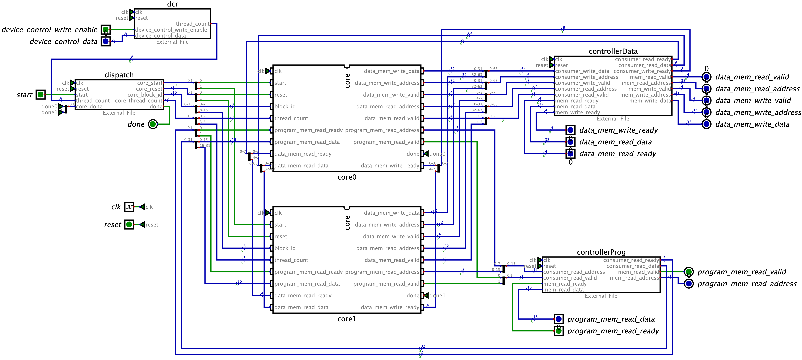

# Open Source GPU Architecture

[](LICENSE)

A minimal, fully open-source GPU implementation in Verilog — designed for learning how GPUs work from the ground up, all the way from architecture down to control signals.

> **What's different from upstream `tiny-gpu`?** Every open community PR is integrated, and many open issues are addressed. See [CHANGES.md](CHANGES.md) for a complete map of merged PRs and resolved issues.

Built with <15 files of fully documented Verilog, complete documentation on architecture & ISA, working matrix addition/multiplication kernels, and full support for kernel simulation & execution traces.

### Table of Contents

- [Overview](#overview)
- [Architecture](#architecture)
  - [GPU](#gpu)
  - [Memory](#memory)
  - [Core](#core)
- [ISA](#isa)
- [Execution](#execution)
  - [Core](#core-1)
  - [Thread](#thread)
- [Kernels](#kernels)
  - [Matrix Addition](#matrix-addition)
  - [Matrix Multiplication](/tree/master?tab=readme-ov-file#matrix-multiplication)
- [Simulation](#simulation)
- [Advanced Functionality](#advanced-functionality)
- [Next Steps](#next-steps)

# Overview

If you want to learn how a CPU works all the way from architecture to control signals, there are many resources online to help you.

GPUs are not the same.

Because the GPU market is so competitive, low-level technical details for all modern architectures remain proprietary.

While there are lots of resources to learn about GPU programming, there's almost nothing available to learn about how GPU's work at a hardware level.

The best option is to go through open-source GPU implementations like [Miaow](https://github.com/VerticalResearchGroup/miaow) and [VeriGPU](https://github.com/hughperkins/VeriGPU/tree/main) and try to figure out what's going on. This is challenging since these projects aim at being feature complete and functional, so they're quite complex.

This is why I built `tiny-gpu`!

## What is tiny-gpu?

> [!IMPORTANT]
>
> **tiny-gpu** is a minimal GPU implementation optimized for learning about how GPUs work from the ground up.
>
> Specifically, with the trend toward general-purpose GPUs (GPGPUs) and ML-accelerators like Google's TPU, tiny-gpu focuses on highlighting the general principles of all of these architectures, rather than on the details of graphics-specific hardware.

With this motivation in mind, we can simplify GPUs by cutting out the majority of complexity involved with building a production-grade graphics card, and focus on the core elements that are critical to all of these modern hardware accelerators.

This project is primarily focused on exploring:

1. **Architecture** - What does the architecture of a GPU look like? What are the most important elements?
2. **Parallelization** - How is the SIMD progamming model implemented in hardware?
3. **Memory** - How does a GPU work around the constraints of limited memory bandwidth?

After understanding the fundamentals laid out in this project, you can checkout the [advanced functionality section](#advanced-functionality) to understand some of the most important optimizations made in production grade GPUs (that are more challenging to implement) which improve performance.

# Architecture

<p float="left">
  
  
</p>

## GPU

tiny-gpu is built to execute a single kernel at a time.

In order to launch a kernel, we need to do the following:

1. Load global program memory with the kernel code
2. Load data memory with the necessary data
3. Specify the number of threads to launch in the device control register
4. Launch the kernel by setting the start signal to high.

The GPU itself consists of the following units:

1. Device control register
2. Dispatcher
3. Variable number of compute cores
4. Memory controllers for data memory & program memory
5. Cache

### Device Control Register

The device control register usually stores metadata specifying how kernels should be executed on the GPU.

In this case, the device control register just stores the `thread_count` - the total number of threads to launch for the active kernel.

### Dispatcher

Once a kernel is launched, the dispatcher is the unit that actually manages the distribution of threads to different compute cores.

The dispatcher organizes threads into groups that can be executed in parallel on a single core called **blocks** and sends these blocks off to be processed by available cores.

Once all blocks have been processed, the dispatcher reports back that the kernel execution is done.

## Memory

The GPU is built to interface with an external global memory. Here, data memory and program memory are separated out for simplicity.

### Global Memory

tiny-gpu data memory has the following specifications:

- 8 bit addressability (256 total rows of data memory)
- 8 bit data (stores values of <256 for each row)

tiny-gpu program memory has the following specifications:

- 8 bit addressability (256 rows of program memory)
- 16 bit data (each instruction is 16 bits as specified by the ISA)

### Memory Controllers

Global memory has fixed read/write bandwidth, but there may be far more incoming requests across all cores to access data from memory than the external memory is actually able to handle.

The memory controllers keep track of all the outgoing requests to memory from the compute cores, throttle requests based on actual external memory bandwidth, and relay responses from external memory back to the proper resources.

Each memory controller has a fixed number of channels based on the bandwidth of global memory.

### Instruction Cache

The same data is often requested from global memory by multiple cores. Constantly access global memory repeatedly is expensive, and since the data has already been fetched once, it would be more efficient to store it on device in SRAM to be retrieved much quicker on later requests.

Each warp slice in every core owns a direct-mapped **L1 instruction cache** (`icache.sv`, 32 lines by default) sitting between its fetcher and the program memory controller. Only cache *misses* consume external fetch bandwidth; loop bodies are served on-chip. The cache is cleared only on a full GPU reset — program memory is immutable while a kernel runs, so it stays warm across all the blocks a core processes.

Cache effectiveness is observable at the top level through the `perf_icache_hit_count` / `perf_icache_miss_count` counters, and `test/test_icache_e2e.py` asserts the architectural invariant that external program-memory transactions equal cache misses (matmul: 41 instructions retired with only 28 external fetches).

## Core

Each core has a number of compute resources, often built around a certain number of threads it can support. In order to maximize parallelization, these resources need to be managed optimally to maximize resource utilization.

In this simplified GPU, each core processed one **block** at a time, and for each thread in a block, the core has a dedicated ALU, LSU, PC, and register file. Managing the execution of thread instructions on these resources is one of the most challening problems in GPUs.

### Scheduler

Each core partitions its block into **warps** of `THREADS_PER_WARP` lanes, and every warp has its own scheduler (warp slice). With the default `THREADS_PER_WARP = THREADS_PER_BLOCK` the whole block is one warp and the design behaves like the classic single-scheduler tiny-gpu. Setting a smaller warp size (e.g. `THREADS_PER_WARP = 2` with a block of 4) yields multiple concurrent warps per core that **hide each other's memory latency** — the defining trick of real GPU schedulers. On a latency-bound kernel, 2 warps/core cut execution from 868 to 647 cycles by overlapping one warp's ALU work with the other's memory waits (`test/test_warp_scheduling_e2e.py`).

Each warp scheduler runs the six-stage instruction lifecycle (`FETCH → DECODE → REQUEST → WAIT → EXECUTE → UPDATE`), with two throughput optimizations over the naive flow:

- instructions that touch no memory **skip the `WAIT` stage** entirely, and
- the fetch of the *next* instruction is **overlapped with execution** of the current one (see Fetcher below).

The scheduler also implements **branch divergence** via min-PC reconvergence: every lane keeps its own PC, the scheduler executes the subset of lanes parked at the minimum PC each step, and diverged lanes automatically reconverge. Block-wide `BAR` barriers synchronise across *all* warps of the block through a per-core barrier coordinator.

The main constraint the scheduler has to work around is the latency associated with loading & storing data from global memory. While most instructions can be executed synchronously, these load-store operations are asynchronous, meaning the rest of the instruction execution has to be built around these long wait times.

### Fetcher

Asynchronously fetches the instruction at the current program counter from its L1 instruction cache.

The fetcher is a **pipelined front-end with speculative next-line prefetch**: as soon as the core moves into `DECODE`, the fetch port is free, so the fetcher immediately starts fetching the *predicted* next instruction while the rest of the pipeline executes the current one. Prediction is static **BTFN** (backward-taken / forward-not-taken): a `BRnzp` whose target is at or behind the current instruction is treated as a loop edge and predicted taken; everything else is predicted to fall through to `PC + 1`. A correct prediction turns the next `FETCH` stage into a single cycle; a misprediction is discarded and refetched (always correct, sometimes slower). Together with the icache and `WAIT`-skip this cuts matmul from 491 to 349 cycles (−29%) and matadd from 178 to 154 (−13%).

### Decoder

Decodes the fetched instruction into control signals for thread execution.

### Register Files

Each thread has it's own dedicated set of register files. The register files hold the data that each thread is performing computations on, which enables the same-instruction multiple-data (SIMD) pattern.

Importantly, each register file contains a few read-only registers holding data about the current block & thread being executed locally, enabling kernels to be executed with different data based on the local thread id.

### ALUs

Dedicated arithmetic-logic unit for each thread to perform computations. Handles the `ADD`, `SUB`, `MUL`, `DIV` arithmetic instructions.

Also handles the `CMP` comparison instruction which actually outputs whether the result of the difference between two registers is negative, zero or positive - and stores the result in the `NZP` register in the PC unit.

### LSUs

Dedicated load-store unit for each thread to access global data memory.

Handles the `LDR` & `STR` instructions - and handles async wait times for memory requests to be processed and relayed by the memory controller.

### PCs

Dedicated program-counter for each unit to determine the next instructions to execute on each thread.

By default, the PC increments by 1 after every instruction.

With the `BRnzp` instruction, the NZP register checks to see if the NZP register (set by a previous `CMP` instruction) matches some case - and if it does, it will branch to a specific line of program memory. _This is how loops and conditionals are implemented._

Since threads are processed in parallel, tiny-gpu assumes that all threads "converge" to the same program counter after each instruction - which is a naive assumption for the sake of simplicity.

In real GPUs, individual threads can branch to different PCs, causing **branch divergence** where a group of threads threads initially being processed together has to split out into separate execution.

# ISA


tiny-gpu implements a simple 11 instruction ISA built to enable simple kernels for proof-of-concept like matrix addition & matrix multiplication (implementation further down on this page).

For these purposes, it supports the following instructions:

- `BRnzp` - Branch instruction to jump to another line of program memory if the NZP register matches the `nzp` condition in the instruction.
- `CMP` - Compare the value of two registers and store the result in the NZP register to use for a later `BRnzp` instruction.
- `ADD`, `SUB`, `MUL`, `DIV` - Basic arithmetic operations to enable tensor math.
- `LDR` - Load data from global memory.
- `STR` - Store data into global memory.
- `CONST` - Load a constant value into a register.
- `RET` - Signal that the current thread has reached the end of execution.

Each register is specified by 4 bits, meaning that there are 16 total registers. The first 13 register `R0` - `R12` are free registers that support read/write. The last 3 registers are special read-only registers used to supply the `%blockIdx`, `%blockDim`, and `%threadIdx` critical to SIMD.

# Execution

### Core

Each core follows the following control flow going through different stages to execute each instruction:

1. `FETCH` - Fetch the next instruction at current program counter from program memory.
2. `DECODE` - Decode the instruction into control signals.
3. `REQUEST` - Request data from global memory if necessary (if `LDR` or `STR` instruction).
4. `WAIT` - Wait for data from global memory if applicable.
5. `EXECUTE` - Execute any computations on data.
6. `UPDATE` - Update register files and NZP register.

The control flow is laid out like this for the sake of simplicity and understandability.

In practice, several of these steps could be compressed to be optimize processing times, and the GPU could also use **pipelining** to stream and coordinate the execution of many instructions on a cores resources without waiting for previous instructions to finish.

### Thread


Each thread within each core follows the above execution path to perform computations on the data in it's dedicated register file.

This resembles a standard CPU diagram, and is quite similar in functionality as well. The main difference is that the `%blockIdx`, `%blockDim`, and `%threadIdx` values lie in the read-only registers for each thread, enabling SIMD functionality.

# Kernels

I wrote a matrix addition and matrix multiplication kernel using my ISA as a proof of concept to demonstrate SIMD programming and execution with my GPU. The test files in this repository are capable of fully simulating the execution of these kernels on the GPU, producing data memory states and a complete execution trace.

### Matrix Addition

This matrix addition kernel adds two 1 x 8 matrices by performing 8 element wise additions in separate threads.

This demonstration makes use of the `%blockIdx`, `%blockDim`, and `%threadIdx` registers to show SIMD programming on this GPU. It also uses the `LDR` and `STR` instructions which require async memory management.

`matadd.asm`

```asm
.threads 8
.data 0 1 2 3 4 5 6 7          ; matrix A (1 x 8)
.data 0 1 2 3 4 5 6 7          ; matrix B (1 x 8)

MUL R0, %blockIdx, %blockDim
ADD R0, R0, %threadIdx         ; i = blockIdx * blockDim + threadIdx

CONST R1, #0                   ; baseA (matrix A base address)
CONST R2, #8                   ; baseB (matrix B base address)
CONST R3, #16                  ; baseC (matrix C base address)

ADD R4, R1, R0                 ; addr(A[i]) = baseA + i
LDR R4, R4                     ; load A[i] from global memory

ADD R5, R2, R0                 ; addr(B[i]) = baseB + i
LDR R5, R5                     ; load B[i] from global memory

ADD R6, R4, R5                 ; C[i] = A[i] + B[i]

ADD R7, R3, R0                 ; addr(C[i]) = baseC + i
STR R7, R6                     ; store C[i] in global memory

RET                            ; end of kernel
```

### Matrix Multiplication

The matrix multiplication kernel multiplies two 2x2 matrices. It performs element wise calculation of the dot product of the relevant row and column and uses the `CMP` and `BRnzp` instructions to demonstrate branching within the threads (notably, all branches converge so this kernel works on the current tiny-gpu implementation).

`matmul.asm`

```asm
.threads 4
.data 1 2 3 4                  ; matrix A (2 x 2)
.data 1 2 3 4                  ; matrix B (2 x 2)

MUL R0, %blockIdx, %blockDim
ADD R0, R0, %threadIdx         ; i = blockIdx * blockDim + threadIdx

CONST R1, #1                   ; increment
CONST R2, #2                   ; N (matrix inner dimension)
CONST R3, #0                   ; baseA (matrix A base address)
CONST R4, #4                   ; baseB (matrix B base address)
CONST R5, #8                   ; baseC (matrix C base address)

DIV R6, R0, R2                 ; row = i // N
MUL R7, R6, R2
SUB R7, R0, R7                 ; col = i % N

CONST R8, #0                   ; acc = 0
CONST R9, #0                   ; k = 0

LOOP:
  MUL R10, R6, R2
  ADD R10, R10, R9
  ADD R10, R10, R3             ; addr(A[i]) = row * N + k + baseA
  LDR R10, R10                 ; load A[i] from global memory

  MUL R11, R9, R2
  ADD R11, R11, R7
  ADD R11, R11, R4             ; addr(B[i]) = k * N + col + baseB
  LDR R11, R11                 ; load B[i] from global memory

  MUL R12, R10, R11
  ADD R8, R8, R12              ; acc = acc + A[i] * B[i]

  ADD R9, R9, R1               ; increment k

  CMP R9, R2
  BRn LOOP                    ; loop while k < N

ADD R9, R5, R0                 ; addr(C[i]) = baseC + i
STR R9, R8                     ; store C[i] in global memory

RET                            ; end of kernel
```

# Simulation

OpenSource GPU Architecture is set up to simulate the execution of both of the above kernels. Before simulating, you'll need to install [iverilog](https://steveicarus.github.io/iverilog/usage/installation.html), [cocotb](https://docs.cocotb.org/en/stable/install.html) and [sv2v](https://github.com/zachjs/sv2v).

### Recommended (Python virtual environment)

Using a virtual environment keeps cocotb and its native helpers isolated from your system Python. This is the path most likely to "just work" on Ubuntu, macOS, and WSL (resolves upstream issues #46, #43, #50).

```bash
# 1. System tools
sudo apt-get install -y iverilog gtkwave        # Ubuntu/Debian
# brew install icarus-verilog gtkwave           # macOS

# 2. Project Python deps in a venv
python3 -m venv .venv
source .venv/bin/activate
pip install --upgrade pip
pip install "cocotb>=2.0" pytest

# 3. sv2v (download the binary for your platform from
#    https://github.com/zachjs/sv2v/releases and put it in $PATH)

# 4. Build directory
mkdir -p build
```

Once the prerequisites are in place, run the kernel simulations with `make test_matadd` and `make test_matmul`. Open the resulting waveforms with `make show_matadd` / `make show_matmul`. Each run is logged under `test/runs/test_<kernel>_<timestamp>.out`.

### Build flow notes

- The default `Makefile` targets the iverilog + cocotb v2.x flow (`COCOTB_TEST_MODULES`, `cocotb-config --lib-dir`, `unit="ns"`). Tested on Ubuntu 22.04 with iverilog 11+.
- For commercial simulators (VCS / Questa / Xcelium) use `make -f Makefile.sv ...` to drive the SystemVerilog sources directly without sv2v.
- For full ASIC / SoC build flows (synthesis, DFT, floorplan, UPF) see `flow/commercial/` (Synopsys/Cadence/Vivado/Quartus, gated on `OPENGPU_COMMERCIAL=1`) or `flow/openlane2/` for the open sky130 path.

### Fast quality gates (local)

Use these top-level targets for quick pre-PR checks:

```bash
# Verilator syntax/lint over src/
make lint_verilator

# SymbiYosys smoke proof (current proven set: formal/dcr)
make formal_smoke

# Functional (MDV) coverage via cocotb-coverage; exports
# test/coverage/functional_coverage.xml and asserts FSM closure
make coverage_functional
```

If tools are missing, the targets fail with a setup hint (install Verilator and
SymbiYosys/OSS CAD Suite, or use the project toolchain container).

Executing the simulations will output a log file with the initial data memory state, complete execution trace of the kernel, and final data memory state.

If you look at the initial data memory state logged at the start of the logfile for each, you should see the two start matrices for the calculation, and in the final data memory at the end of the file you should also see the resultant matrix.

Below is a sample of the execution traces, showing on each cycle the execution of every thread within every core, including the current instruction, PC, register values, states, etc.


## Visualization

The whole GPU is also visualized in [*Digital*](https://github.com/hneemann/Digital). You can play around with different components by manually setting inputs and observing outputs very easily. To view the top `gpu.dig` module, make sure you have [*Digital*](https://github.com/hneemann/Digital) and `icarus-verilog` installed.



# Advanced Functionality

Modern GPUs implement many features beyond the minimal learning core. This fork has **implemented several of them in the verified `gpu` top** — each marked below with where it lives and the end-to-end test that proves it. The remaining ones stay documented as roadmap concepts.

| Feature | Status | RTL | Proven by |
|---|---|---|---|
| L1 instruction cache (per warp slice) | ✅ implemented | `icache.sv` | `test_icache_e2e.py` |
| Front-end pipelining (speculative prefetch, BTFN) | ✅ implemented | `fetcher.sv` | `test_matmul.py` (−29% cycles), full sweep |
| `WAIT`-skip for non-memory instructions | ✅ implemented | `scheduler.sv` | full sweep |
| Warp scheduling (multi-warp cores, latency hiding) | ✅ implemented | `core.sv` + `scheduler.sv` | `test_warp_scheduling_e2e.py` (−25% cycles) |
| Branch divergence (min-PC reconvergence) | ✅ implemented | `scheduler.sv` | `test_divergence_e2e.py`, `test_nested_divergence.py` |
| Warp-level memory coalescing (same-address reads) | ✅ implemented | `gpu.sv` | `test_coalesce_broadcast_e2e.py` |
| Shared memory (banked, per block) | ✅ implemented | `shared_memory.sv` | `test_shared_memory_e2e.py` |
| Barriers (block-wide, cross-warp) | ✅ implemented | `scheduler.sv` + `core.sv` | `test_barrier_e2e.py`, `test_warp_scheduling_e2e.py` |
| Atomics (`ATOMICADD` / `ATOMICCAS`) | ✅ implemented | `lsu.sv` + `controller.sv` | `test_atomic_add.py`, `test_atomic_cas.py` |
| Graphics kernel (SIMT rasterizer) | ✅ implemented | ISA kernel | `test_graphics_e2e.py` |
| Data cache, multi-level hierarchy | roadmap | — | — |
| Address-range (burst) coalescing | roadmap | — | — |

### Multi-layered Cache & Shared Memory

In modern GPUs, multiple different levels of caches are used to minimize the amount of data that needs to get accessed from global memory. tiny-gpu implements only one cache layer between individual compute units requesting memory and the memory controllers which stores recent cached data.

Implementing multi-layered caches allows frequently accessed data to be cached more locally to where it's being used (with some caches within individual compute cores), minimizing load times for this data.

Different caching algorithms are used to maximize cache-hits - this is a critical dimension that can be improved on to optimize memory access.

Additionally, GPUs often use **shared memory** for threads within the same block to access a single memory space that can be used to share results with other threads.

### Memory Coalescing

Another critical memory optimization used by GPUs is **memory coalescing.** Multiple threads running in parallel often need to access sequential addresses in memory (for example, a group of threads accessing neighboring elements in a matrix) - but each of these memory requests is put in separately.

Memory coalescing is used to analyzing queued memory requests and combine neighboring requests into a single transaction, minimizing time spent on addressing, and making all the requests together.

### Pipelining

In the original control flow, cores waited for one instruction to be fully executed before even *fetching* the next one. This fork overlaps the front-end with execution: the fetcher speculatively prefetches the BTFN-predicted next instruction while the current one moves through `REQUEST`/`WAIT`/`EXECUTE`/`UPDATE`, and non-memory instructions skip `WAIT` entirely. A full issue-pipeline with hazard tracking (scoreboards, operand collectors) remains future work.

### Warp Scheduling

Another strategy used to maximize resource utilization on course is **warp scheduling.** This approach involves breaking up blocks into individual batches of theads that can be executed together.

Multiple warps can be executed on a single core simultaneously by executing instructions from one warp while another warp is waiting. This is similar to pipelining, but dealing with instructions from different threads.

This fork implements it: set `THREADS_PER_WARP < THREADS_PER_BLOCK` on the `gpu` top and each core partitions its block into independent warp slices (own fetcher + icache + decoder + scheduler) that share the block's datapath lanes, shared-memory island, and barrier coordinator. `test/test_warp_scheduling_e2e.py` builds the 2-warps-per-core configuration and measures 310 cycles of true overlap (one warp executing while another waits on memory) on a latency-bound kernel — 868 → 647 cycles vs. lockstep.

### Branch Divergence

The original tiny-gpu assumed that all threads in a single batch end up on the same PC after each instruction, meaning that threads can be executed in parallel for their entire lifetime.

In reality, individual threads diverge from each other and branch to different lines based on their data. This fork implements **min-PC reconvergence**: every lane keeps its own PC, each step executes the lanes parked at the minimum PC of the warp, and lanes that branched ahead are frozen until the rest catch up — correct for structured control flow with no explicit IPDOM stack. Divergence is observable through the top-level `perf_divergence_count` counter and proven by `test_divergence_e2e.py` and `test_nested_divergence.py`.

### Synchronization & Barriers

Another core functionality of modern GPUs is the ability to set **barriers** so that groups of threads in a block can synchronize and wait until all other threads in the same block have gotten to a certain point before continuing execution.

This fork implements a block-wide `BAR` instruction. Lanes of a warp park at the barrier while lagging lanes catch up; in multi-warp configurations a per-core coordinator releases every warp only once *all* live warps of the block have arrived — with retired warps correctly excluded so a block can never deadlock on a barrier a finished warp will never reach.

# Next Steps

Roadmap status — items from the original tiny-gpu wishlist that this fork has completed, plus what remains:

- [x] Add a simple cache for instructions — per-warp-slice direct-mapped L1I (`icache.sv`), proven by `test_icache_e2e.py`
- [x] Build an adapter to use GPU with Tiny Tapeout 7 — `tt_um_tiny_gpu.sv`, tested via `make test_tt_adapter` (5 subtests)
- [x] Add basic branch divergence — min-PC reconvergence in `scheduler.sv`
- [x] Add basic memory coalescing — warp-level same-address read coalescing in `gpu.sv`
- [x] Add basic pipelining — speculative BTFN prefetch overlapped with execution (`fetcher.sv`)
- [x] Optimize control flow and use of registers to improve cycle time — `WAIT`-skip + single-cycle predicted fetch (matmul −29%, matadd −13%)
- [x] Write a basic graphics kernel — SIMT edge-function rasterizer, `test_graphics_e2e.py`
- [x] Warp scheduling — multi-warp cores with cross-warp barriers (`THREADS_PER_WARP` parameter)
- [ ] Data cache (L1D) + multi-level cache hierarchy
- [ ] Address-range (burst) coalescing for strided access patterns
- [ ] Scoreboarded issue pipeline (multiple instructions in flight per warp)
- [ ] Dedicated graphics hardware path (the `rasterizer.sv` / `framebuffer.sv` SoC modules are not yet wired into the verified `gpu` top)

**For anyone curious to play around or make a contribution, feel free to put up a PR with any improvements you'd like to add 😄**

---

## Credits

This project is based on [**tiny-gpu**](https://github.com/adam-maj/tiny-gpu) by **[Adam Majmudar (@adam-maj)](https://github.com/adam-maj)**. All original architecture, Verilog source, ISA design, and documentation are the work of the original author. This repository preserves and builds upon that work as *Open Source GPU Architecture* for continued learning, experimentation, and community contribution.

Huge thanks to **Adam Majmudar** for making GPU internals approachable to everyone. 🙏
