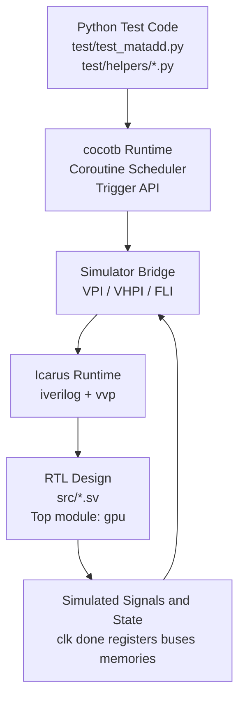

# cocotb in 10 minutes: where it sits in the simulation stack

This guide is for readers who already write C/C++ but are new to
Verilog/SystemVerilog and to cocotb.

It only tries to do three things:

1. Explain where cocotb sits in the overall simulation flow.
2. Explain which layer the RTL, the simulator and the Python tests each live in.
3. Walk through one concrete `test_matadd` run end-to-end against this
   repository.

---

## 1. One-line intuition

You can roughly model the system like this:

- **RTL / Verilog / SystemVerilog**: the "hardware program" being tested.
- **Simulator**: the engine that executes that hardware description.
- **cocotb**: the bridge that lets Python talk to the simulator.
- **Python test code**: behaves like a testbench -- drives the DUT, waits for
  clock edges, checks results.

So cocotb is **not** the RTL itself, and **not** the simulator itself. It is
the **Python testing framework** that sits between the two.

---

## 2. Layered view: who is on top of whom



Reading top-down:

1. The top layer is your Python test, e.g. `test_matadd.py`.
2. It calls cocotb APIs such as `RisingEdge`, `ReadOnly`, `@cocotb.test()`.
3. cocotb talks to the simulator through a simulator interface (VPI etc.).
4. The simulator executes the RTL underneath.
5. The RTL produces signal values, register state, and bus values inside the
   simulator.

Python is therefore not "executing Verilog directly." It **observes and
drives the DUT inside the simulator through cocotb**.

---

## 3. End-to-end flow of a cocotb test

```mermaid
flowchart LR
    a[SystemVerilog RTL<br/>src/*.sv] --> b[sv2v<br/>convert to Verilog]
    b --> c[iverilog<br/>compile and elaborate]
    c --> d[vvp<br/>start simulation runtime]
    d --> e[cocotb loads Python test]
    e --> f[test_matadd starts]
    f --> g[drive reset and clock]
    g --> h[load program and data memory]
    h --> i[assert start and wait cycles]
    i --> j[read dut signals and logs]
    j --> k[assert final memory results]
```



A useful analogy:

- `sv2v + iverilog + vvp` is responsible for **bringing the hardware world to
  life**.
- cocotb is responsible for **plugging the Python test into that world**.
- Python code is responsible for **stimulating inputs, observing outputs and
  asserting expectations**.

---

## 4. Which file in this repo lives in which layer?

### Hardware layer

These files describe the design under test -- the GPU itself:

- `src/gpu.sv`
- `src/core.sv`
- `src/decoder.sv`
- `src/alu.sv`
- the rest of `src/*.sv`

Think of them as "hardware source code."

### Test layer

These files belong to the cocotb / Python test layer:

- `test/test_matadd.py`
- `test/test_matmul.py`
- `test/helpers/setup.py`
- `test/helpers/memory.py`
- `test/helpers/logger.py`
- `test/helpers/format.py`

They do not implement any GPU hardware; they play the role of testbench.

### Build / simulation layer

These pieces compile the design and run it:

- `Makefile`
- `sv2v`
- `iverilog`
- `vvp`

This layer is closer to a build system + runtime environment.

---

## 5. What exactly is `dut`?

In the test entry point you will see:

```python
@cocotb.test()
async def test_matadd(dut):
```

`dut` here is:

- **not** a Python object you constructed yourself,
- **not** a plain data structure,
- it is **a DUT handle that cocotb passed in**.

`DUT` is short for *Device Under Test*.

You can think of `dut` as:

> A Python-side "handle" that points to the top-level Verilog instance.

That is why code like the following works:

```python
await RisingEdge(dut.clk)
while dut.done.value != 1:
    ...
```

It means:

- `dut.clk`: access the DUT's clock signal.
- `dut.done`: access the DUT's done signal.
- `dut.<name>`: access any port or hierarchical object named `<name>` on the DUT.

If you reach for a C++ analogy, it behaves like "a top-level object handle
exposed by the simulator."

---

## 6. Why does the Python code constantly convert between strings and ints?

This is the part that confuses software-background newcomers the most.

The short answer:

> **Verilog signals are bit vectors, not strings.** But in cocotb tests we
> often turn a signal value into a string temporarily, because slicing,
> printing and inspecting are easier that way.

For example, `test/helpers/memory.py` contains code like:

```python
mem_read_address_bits = str(self.mem_read_address.value)
address_slice = mem_read_address_bits[i : i + self.addr_bits]
mem_read_address.append(int(address_slice, 2))
```

What those three steps do:

1. Convert the bus value into a string, e.g. `"0000010100000011"`.
2. Slice out one lane's worth of address bits.
3. Convert that slice back to an integer so it can index a Python list.

So the picture is:

- **Hardware layer**: it is a sequence of bits.
- **Python observation layer**: it is rendered as a string for slicing.
- **Python compute layer**: it is parsed back into an int for indexing /
  arithmetic.

This is a very common testbench idiom.

---

## 7. Division of labour during one `test_matadd` run

### What the RTL does

The RTL implements the actual hardware behaviour:

- instruction fetch
- decode
- register read/write
- memory accesses
- ALU operations
- finally driving `done` high

All of this happens inside `src/*.sv`.

### What cocotb / Python does

The Python test is responsible for:

- bringing up the clock and applying reset
- pre-loading program memory
- pre-loading data memory
- calling `data_memory.run()` to service memory handshakes
- waiting for `dut.done`
- dumping logs
- asserting that the final memory contents are correct

In other words, Python is not "implementing the GPU algorithm." It is
**driving and validating** the GPU.

---

## 8. Where does `test/helpers/memory.py` fit in?

This file is important because it is **not** a real RAM in the RTL -- it is a
**Python-side memory model** built into the testbench.

The data flow looks like:

```text
RTL issues read / write requests
    -> Memory.run() in cocotb consumes those requests
    -> the Python list `self.memory` plays the role of "software RAM"
    -> Memory.run() drives read_data / ready back onto DUT signals
```

So:

- The hardware core lives inside the RTL.
- A non-trivial part of the program/data memory in the testbench actually
  lives on the Python side.

This often surprises engineers from a software background. You might assume
"everything is in Verilog," but in a cocotb environment **peripheral models,
memory models and driver logic are frequently written in Python**.

---

## 9. A practical mental model

If you have written C++ unit tests before, this mapping helps:

- **RTL** is like the "library under test."
- **Simulator** is like the "runtime that runs that library."
- **cocotb** is like the "adapter that plugs Python tests into that runtime."
- **Python test** is like "test code + mocks + assertions."

But add a few hardware-specific twists:

- It is not function-call sequencing; it is clock-driven concurrent logic.
- The "objects" are not regular variables; they are signals and bit vectors.
- A bit is not always `0` or `1`; you may also see `X` and `Z`.

---

## 10. The full real path through this repo

Putting all the real names together:

1. `make test_matadd`
2. `sv2v` converts `src/*.sv` into plain Verilog.
3. `iverilog` compiles the Verilog into a simulation image.
4. `vvp` starts the simulation.
5. cocotb loads `test/test_matadd.py`.
6. cocotb passes the elaborated top-level instance into `test_matadd(dut)`.
7. `setup()` raises the clock, applies reset and pre-loads memories.
8. Each cycle, `Memory.run()` services program and data memory requests.
9. The Python test waits on `RisingEdge(dut.clk)` until `dut.done == 1`.
10. The test then inspects the log and the final memory to decide pass/fail.

---

## 11. Three questions to ask while reading cocotb code

Whenever you read a piece of cocotb code, ask yourself:

1. Is this code *driving* the DUT, or *observing* it?
2. Is this operating on a Python variable, or on a DUT signal?
3. Is this happening *before*, *during* or *after* a particular clock edge?

Once those three are clear, cocotb code becomes much easier to follow.

---

## 12. The takeaways worth remembering right now

- cocotb is a **Python testing framework**, not RTL and not a simulator.
- The RTL lives in `src/*.sv` and is responsible for hardware behaviour.
- Python lives in `test/*.py` and is responsible for driving, modelling,
  observing and asserting.
- `dut` is the "design-under-test handle" cocotb injects into your test.
- Signals are fundamentally bit vectors; the strings and ints you see are
  just convenient representations the Python side uses for processing.
