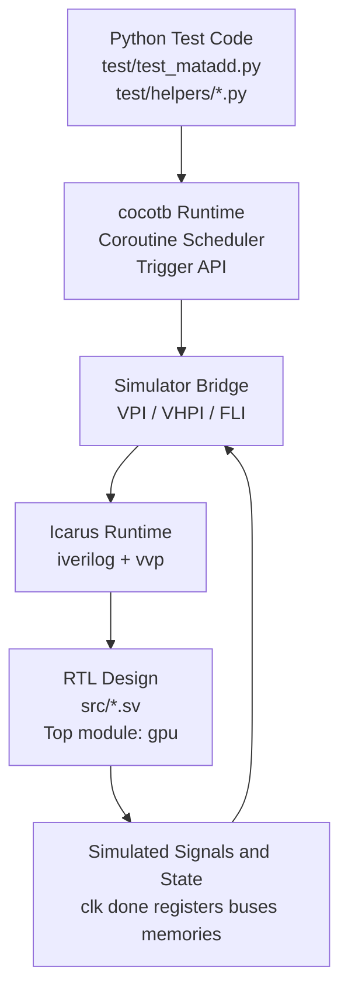

```mermaid
flowchart LR
    a[SystemVerilog RTL<br/>src/*.sv] --> b[sv2v<br/>convert to Verilog]
    b --> c[iverilog<br/>compile and elaborate]
    c --> d[vvp<br/>start simulation runtime]
    d --> e[cocotb loads Python test]
    e --> f[test_matadd starts]
    f --> g[drive reset and clock]
    g --> h[load program and data memory]
    h --> i[assert start and wait cycles]
    i --> j[read dut signals and logs]
    j --> k[assert final memory results]
```

# cocotb 入门：它在仿真流程里的哪一层

这份说明面向有 C/C++ 背景、但刚接触 Verilog/SystemVerilog 和 cocotb 的读者。

目标只有三个：

1. 解释 cocotb 在整个仿真流程里的位置
2. 解释 RTL、仿真器、Python 测试分别处于哪一层
3. 结合本仓库说明一次 `test_matadd` 是怎么跑起来的

---

## 1. 一句话先建立直觉

可以先把整个系统粗略理解成下面这样：

- **RTL / Verilog / SystemVerilog**：被测试的“硬件程序”
- **仿真器**：执行这些硬件描述的引擎
- **cocotb**：把 Python 接到仿真器上的桥
- **Python 测试代码**：像 testbench 一样驱动 DUT、等待时钟、检查结果

所以 cocotb 不是 RTL 本身，也不是仿真器本身，而是位于两者之间的**Python 测试框架**。

---

## 2. 分层图：谁在上，谁在下

下面这张图先回答“各自在哪一层”。



从上往下看：

1. 最上层是你写的 Python 测试，比如 `test_matadd.py`
2. 它调用 cocotb 的 API，比如 `RisingEdge`、`ReadOnly`、`@cocotb.test()`
3. cocotb 再通过仿真接口和仿真器通信
4. 仿真器执行底下的 RTL
5. RTL 在仿真器内部产生各种信号值、寄存器状态、总线值

所以 Python 并不是“直接执行 Verilog”，而是**通过 cocotb 间接观察和驱动仿真器里的 DUT**。

---

## 3. 流程图：一次 cocotb 测试是怎么跑起来的

这张图回答“流程怎么走”。



可以把它类比成：

- `sv2v + iverilog + vvp` 负责把硬件世界跑起来
- cocotb 负责把 Python 测试挂进去
- Python 代码负责“刺激输入 + 观察输出 + 做断言”

---

## 4. 本仓库里，哪些文件属于哪一层

### 硬件层

这些文件描述的是被测设计，也就是 GPU 本体：

- `src/gpu.sv`
- `src/core.sv`
- `src/decoder.sv`
- `src/alu.sv`
- 其他 `src/*.sv`

这些文件属于 RTL 层。你可以把它们理解成“硬件源码”。

### 测试层

这些文件属于 cocotb/Python 测试层：

- `test/test_matadd.py`
- `test/test_matmul.py`
- `test/helpers/setup.py`
- `test/helpers/memory.py`
- `test/helpers/logger.py`
- `test/helpers/format.py`

这些文件不实现 GPU 硬件功能，而是在仿真时扮演“测试平台”的角色。

### 构建与仿真层

这些内容负责把设计编译并跑起来：

- `Makefile`
- `sv2v`
- `iverilog`
- `vvp`

这一层更像“构建系统 + 运行时环境”。

---

## 5. `dut` 到底是哪一层的对象

在测试入口里你会看到：

```python
@cocotb.test()
async def test_matadd(dut):
```

这里的 `dut`：

- 不是你手动 new 出来的 Python 对象
- 也不是某个普通数据结构
- 它是 **cocotb 传进来的 DUT 句柄**

`DUT` 是 `Device Under Test` 的缩写，意思是“被测设计”。

你可以把 `dut` 理解成：

> Python 世界里指向 Verilog 顶层实例的一根“把手”。

所以你才能写出这样的代码：

```python
await RisingEdge(dut.clk)
while dut.done.value != 1:
    ...
```

它的含义就是：

- `dut.clk`：访问 DUT 的时钟信号
- `dut.done`：访问 DUT 的完成信号
- `dut.xxx`：访问 DUT 上名为 `xxx` 的端口或层次对象

如果用 C++ 类比，它有点像“仿真器暴露出来的顶层对象句柄”。

---

## 6. 为什么 Python 代码里经常看到“字符串 <-> 整数”的转换

这部分最容易让软件背景的初学者困惑。

先说结论：

> **Verilog 信号本质上是位向量，不是字符串。**
> 但在 cocotb 的 Python 代码里，开发者经常把信号值临时转成字符串，方便切片、打印和观察。

例如在 `test/helpers/memory.py` 中会有这种代码：

```python
mem_read_address_bits = str(self.mem_read_address.value)
address_slice = mem_read_address_bits[i : i + self.addr_bits]
mem_read_address.append(int(address_slice, 2))
```

这三步分别在干什么：

1. 把总线值转成字符串，例如 `0000010100000011`
2. 按地址宽度切出每个 lane 的那一段 bit
3. 再把那段 bit 转回整数，拿去做列表下标

所以不是“信号本来就是字符串”，而是：

- **在硬件层**：它是一串 bit
- **在 Python 观察层**：为了方便切片，先显示成字符串
- **在 Python 计算层**：为了索引/计算，再转成整数

这是一种很常见、也很直观的 testbench 写法。

---

## 7. 一次 `test_matadd` 的分工

下面按“谁负责什么”来看一次测试。

### RTL 负责什么

RTL 负责真正的硬件行为，例如：

- 取指
- 译码
- 读写寄存器
- 发起访存
- 执行 ALU 操作
- 最后拉高 `done`

这些行为发生在 `src/*.sv` 里。

### cocotb/Python 负责什么

Python 测试负责：

- 建立时钟和复位
- 预装 program memory
- 预装 data memory
- 调用 `data_memory.run()` 响应访存握手
- 等待 `dut.done`
- 读取日志
- 检查最终内存值是否正确

换句话说，Python 不是在“实现 GPU 算法”，而是在**驱动和验证** GPU。

---

## 8. `test/helpers/memory.py` 在整个系统中的位置

这份文件很关键，因为它不是 RTL 里的真正 RAM，而是 **Python 写的内存模型**。

它处在这个位置：

```text
RTL 发出读写请求
    -> cocotb 里的 Memory.run() 读取这些请求
    -> Python 列表 self.memory 充当“软件内存”
    -> 再把 read_data / ready 写回 dut 信号
```

也就是说：

- 硬件核心在 RTL 里
- 但测试里的 program/data memory，有一部分是 Python 侧在配合模拟

这和很多软件背景工程师第一次接触 cocotb 时的直觉不同。你可能以为“所有东西都在 Verilog 里”，但在测试环境里，**外设模型、内存模型、驱动逻辑** 很多都可以写在 Python 里。

---

## 9. 一个最实用的心智模型

如果你以前写过 C++ 单元测试，可以先这样记：

- **RTL** 像“待测库”
- **仿真器** 像“执行这个库的运行时”
- **cocotb** 像“把 Python 测试接到运行时上的适配层”
- **Python 测试** 像“测试代码 + mock + assertions”

但要额外加上一点硬件特性：

- 这里不是函数调用，而是时钟驱动的并发逻辑
- 这里的对象不是普通变量，而是信号和位向量
- 这里的值可能不仅有 `0/1`，还会有 `X/Z`

---

## 10. 把这个仓库的真实执行路径串起来

最后用仓库里的真实名字再串一遍：

1. `make test_matadd`
2. `sv2v` 把 `src/*.sv` 转成 Verilog
3. `iverilog` 编译生成仿真镜像
4. `vvp` 启动仿真
5. cocotb 加载 `test/test_matadd.py`
6. cocotb 把顶层模块实例作为 `dut` 传给 `test_matadd(dut)`
7. `setup()` 负责拉时钟、复位、装载数据
8. `Memory.run()` 在每个周期响应程序存储器和数据存储器请求
9. Python 测试不断等待 `RisingEdge(dut.clk)`，直到 `dut.done == 1`
10. 测试检查日志和最终内存，决定 pass/fail

---

## 11. 读这类代码时，建议按这三个问题去看

每看到一段 cocotb 代码，都可以先问自己：

1. 这段代码是在驱动 DUT，还是在观察 DUT？
2. 这段代码操作的是 Python 变量，还是 DUT 信号？
3. 这段代码发生在“某个时钟周期之前、之中，还是之后”？

只要这三个问题分清楚，cocotb 代码会清晰很多。

---

## 12. 你现在最值得记住的结论

- cocotb 是 **Python 测试框架**，不是 RTL，也不是仿真器
- RTL 在 `src/*.sv`，负责硬件行为
- Python 在 `test/*.py`，负责驱动、建模、观察和断言
- `dut` 是 cocotb 注入的“被测设计句柄”
- 信号本质是位向量；字符串和整数只是 Python 侧为了处理方便做的表示转换

如果这套心智模型建立起来了，后面再看 `test_matadd.py`、`memory.py`、`setup.py` 就会顺很多。