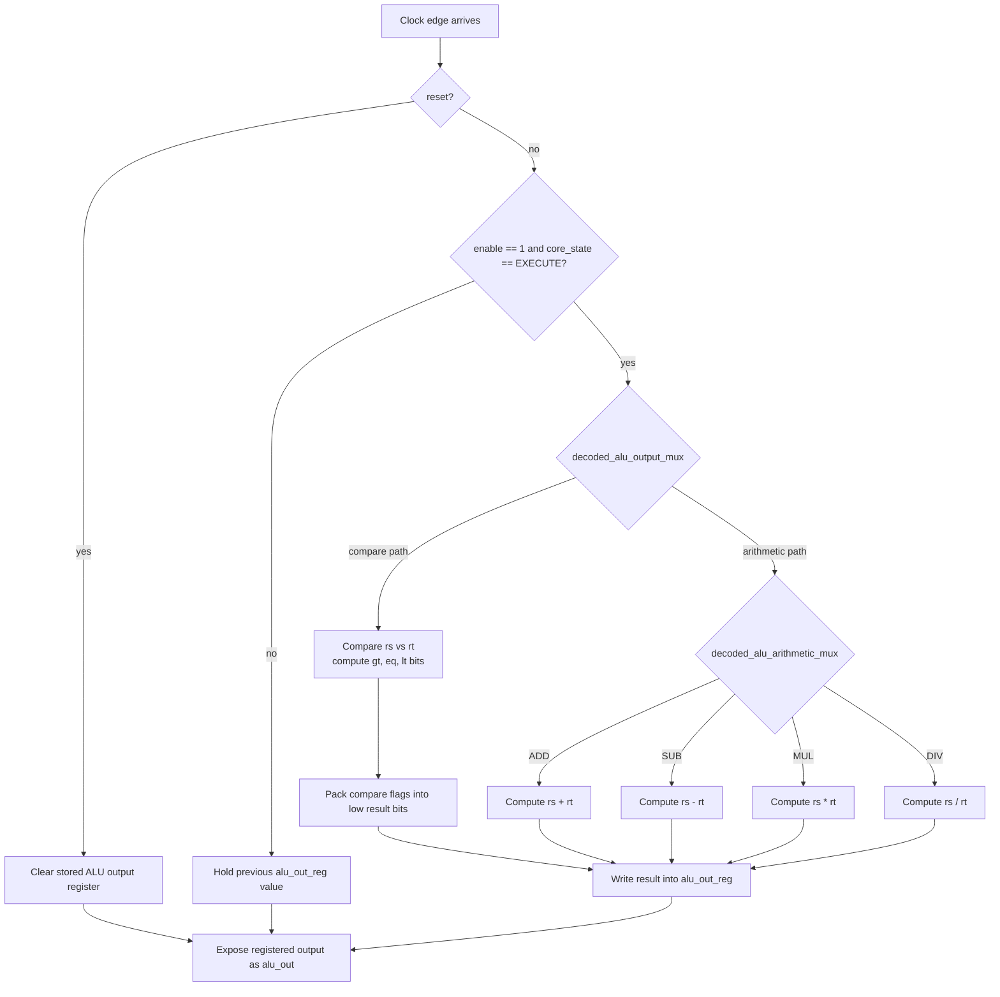

# ALU Module

Source: `src/alu.sv`

## What this module is

`alu.sv` is the per-thread arithmetic unit. Each active thread lane inside a core gets its own ALU instance, so all threads can execute the same arithmetic instruction in parallel on different register values.

In DeepWiki terms, this is one of the thread execution units inside the core's replicated datapath.

## Where it sits in tiny-gpu

- **Upstream:** `registers.sv` provides `rs` and `rt`; `decoder.sv` provides ALU control bits; `scheduler.sv` provides the shared `core_state`
- **Downstream:** `registers.sv` may write `alu_out` back into `rd`; `pc.sv` uses the low 3 bits during `CMP`

## Clock/reset and when work happens

- Synchronous module: work happens on `posedge clk`
- Reset clears the stored output register
- Useful work only happens when:
  - `enable == 1`
  - `core_state == EXECUTE (3'b101)`

## Interface cheat sheet

| Port group | Meaning |
|---|---|
| `clk`, `reset` | standard sequential timing |
| `enable` | disables unused thread lanes in a partially full block |
| `core_state` | stage gating from the scheduler |
| `decoded_alu_arithmetic_mux` | selects ADD / SUB / MUL / DIV |
| `decoded_alu_output_mux` | selects arithmetic path vs compare path |
| `rs`, `rt` | source operands from the register file |
| `alu_out` | final registered ALU result |

## Diagram

## Behavior walkthrough

1. The scheduler moves the whole core into `EXECUTE`.
2. The decoder has already chosen which ALU behavior is needed.
3. If the instruction is normal arithmetic, the ALU uses the arithmetic mux.
4. If the instruction is `CMP`, the ALU does not return a normal arithmetic result. Instead, it packs comparison flags into the low 3 bits.
5. The result is written into `alu_out_reg`, so the output is **registered**, not purely combinational.

## Decision logic to focus on

- First gate: only act in `EXECUTE`
- Second gate: arithmetic result vs compare result
- Third gate: which arithmetic sub-operation to apply

The important beginner insight is that the ALU is **not choosing instructions directly**. It only reacts to the control signals already produced by the decoder.

## Timing notes

- `rs` and `rt` are prepared earlier by `registers.sv`
- `alu_out` becomes meaningful after the `EXECUTE` edge
- For `CMP`, `pc.sv` later samples `alu_out[2:0]` during `UPDATE` to refresh the NZP register

## Common pitfalls

- Thinking `CMP` writes a normal number into a general register. It does not.
- Thinking the ALU always runs every cycle. It is stage-gated.
- Missing that `alu_out` is backed by `alu_out_reg`, so old values persist until overwritten.

## Trace-it-yourself

Try the instruction `ADD R6, R4, R5`:

1. In `REQUEST`, the register file snapshots `R4` and `R5` into `rs` and `rt`
2. In `EXECUTE`, the ALU sees arithmetic mode + ADD sub-op
3. On the clock edge, it stores `rs + rt` into `alu_out_reg`
4. In `UPDATE`, the register file writes that value into `R6`

## Read next

- [`registers.md`](./registers.md)
- [`pc.md`](./pc.md)
- [`decoder.md`](./decoder.md)
