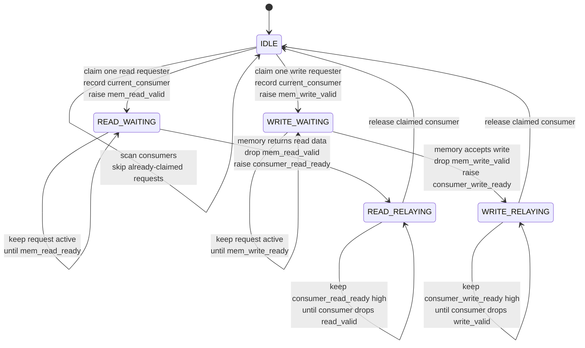

# Controller Module

Source: `src/controller.sv`

## What this module is

`controller.sv` is the memory traffic manager. It sits between many internal requesters and a smaller number of external memory channels.

The same module is reused for both:

- **program memory** requests from fetchers
- **data memory** requests from LSUs

DeepWiki's memory-system description matches this role exactly: the controller is the bandwidth gatekeeper and response relay.

## Where it sits in tiny-gpu

- **Upstream:** fetchers or LSUs behave like "consumers"
- **Downstream:** external program memory or data memory
- **Sibling concept:** one controller instance can have several independent channels, and each channel has its own internal state

## Clock/reset and when work happens

- Entirely synchronous on `posedge clk`
- Reset clears all valid/ready outputs and returns every channel to `IDLE`
- After reset, each channel repeatedly:
  - looks for a request
  - forwards it to memory
  - waits for memory
  - relays completion back to the right consumer

## Interface cheat sheet

| Port group | Meaning |
|---|---|
| `consumer_read_*` | incoming read requests from fetchers/LSUs |
| `consumer_write_*` | incoming write requests from LSUs |
| `consumer_*_ready` | completion signal back to the original requester |
| `mem_read_*` | outgoing read request to external memory |
| `mem_write_*` | outgoing write request to external memory |
| `current_consumer[]` | which requester each channel is currently serving |
| `channel_serving_consumer` | prevents two channels from claiming the same requester |

## Diagram

## Behavior walkthrough

1. Each memory channel behaves like a tiny worker.
2. While idle, a channel scans consumers looking for a request not already claimed by another channel.
3. Once found, the channel records `current_consumer[i]` and raises the corresponding memory-side valid signal.
4. It then waits for external memory to acknowledge/return data.
5. After memory responds, the controller raises the corresponding consumer-side `ready` signal.
6. It does **not** immediately forget the request. It waits for the consumer to drop its `valid`, which serves as the acknowledgement.
7. Only then does the channel return to `IDLE` and become free again.

## State machine idea

- `IDLE`: channel is free and looking for work
- `READ_WAITING`: a read request has been forwarded to memory
- `WRITE_WAITING`: a write request has been forwarded to memory
- `READ_RELAYING`: read data is ready and being presented back to the consumer
- `WRITE_RELAYING`: write completion is being presented back to the consumer

## Timing notes

- `valid` and `ready` are not one-cycle pulses by accident here; they are part of a handshake lifecycle
- `channel_serving_consumer` is important because multiple channels are updated in the same clocked block
- The relay states intentionally hold `consumer_*_ready` high until the requester lowers `valid`

## Common pitfalls

- Thinking `ready` means "the channel is idle." Here it often means "your request has completed."
- Missing that there are **two** sides of handshake: consumer side and memory side.
- Forgetting this module can represent either program-memory traffic or data-memory traffic depending on parameters.

## Trace-it-yourself

Imagine one LSU asserts `consumer_read_valid[3]`:

1. A free channel in `IDLE` claims consumer 3
2. It copies `consumer_read_address[3]` to `mem_read_address[i]`
3. It waits in `READ_WAITING`
4. When `mem_read_ready[i]` arrives, it copies `mem_read_data[i]` back into `consumer_read_data[3]`
5. It raises `consumer_read_ready[3]`
6. When the LSU drops `consumer_read_valid[3]`, the channel goes back to `IDLE`

## Read next

- [`fetcher.md`](./fetcher.md)
- [`lsu.md`](./lsu.md)
- [`scheduler.md`](./scheduler.md)
