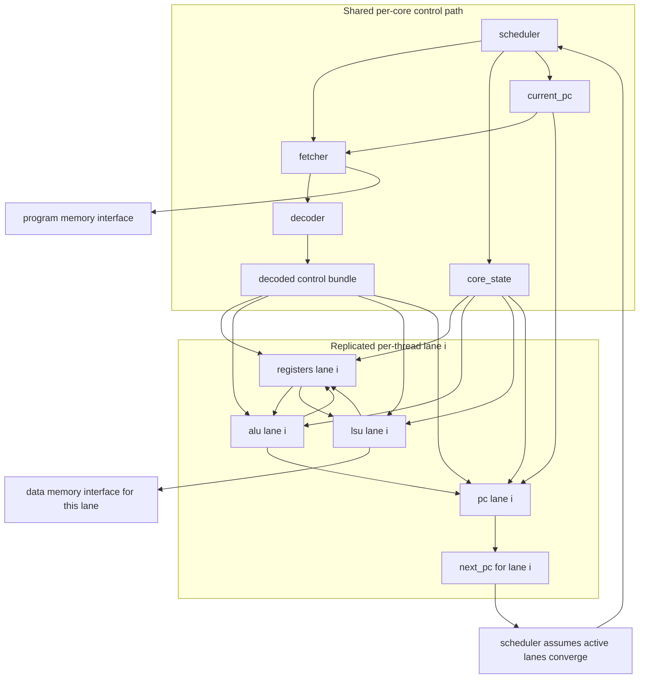

# Core Module

Source: `src/core.sv`

## What this module is

`core.sv` is the main compute engine for one block of threads. If the smaller module docs explain the **parts**, this file explains how those parts are assembled into one working SIMD-style core.

The key beginner mental model is this:

- **one shared control path** per core
- **many replicated thread lanes** per core

So the core behaves like **one instruction stream controlling several per-thread datapaths in parallel**.

This matches the repo's DeepWiki architecture model: the core contains a fetcher, decoder, scheduler, and per-thread execution units.

## Where it sits in tiny-gpu

- **Upstream:** `dispatch.sv` starts the core on a specific block and tells it `block_id` and `thread_count`
- **Inside the core:**
  - shared modules: `fetcher`, `decoder`, `scheduler`
  - per-thread modules: `registers`, `alu`, `lsu`, `pc`
- **Downstream:**
  - program-memory controller sees fetch traffic
  - data-memory controller sees LSU traffic
  - dispatcher sees `done`

## Clock/reset and when work happens

- Entire module is synchronous through its submodules
- `reset` resets the whole core and all its internal submodules
- `start` tells the scheduler to begin executing the assigned block
- The scheduler drives the per-instruction rhythm using `core_state`

## Interface cheat sheet

| Group | Meaning |
|---|---|
| `start`, `done` | per-block launch and completion handshake |
| `block_id`, `thread_count` | metadata for the currently assigned block |
| `program_mem_*` | one shared instruction fetch interface for the whole core |
| `data_mem_read_*`, `data_mem_write_*` | per-thread data-memory interfaces for LSU traffic |
| `core_state`, `instruction`, decoded signals | shared control-path signals inside the core |
| `rs/rt`, `alu_out`, `lsu_out`, `next_pc` arrays | per-thread lane datapath signals |

## Diagram



## How to read this file

This file is mostly an **integration file**. It does not invent a lot of new behavior. Instead, it answers these questions:

1. Which modules are shared per core?
2. Which modules are duplicated per thread lane?
3. How do the shared control signals fan out to all lanes?
4. How do the per-lane outputs feed back into shared control?

That is why `core.sv` has many wires/regs and many module instantiations, but relatively little algorithmic logic of its own.

## Behavior walkthrough

1. The dispatcher gives this core a `block_id` and `thread_count`.
2. The scheduler starts in charge of the block's instruction lifecycle.
3. The fetcher retrieves one instruction from program memory using the shared `current_pc`.
4. The decoder turns that instruction into shared control signals.
5. Those shared control signals are broadcast to **all active thread lanes**.
6. Inside each lane:
   - `registers` provides operands
   - `alu` computes arithmetic or compare results
   - `lsu` performs memory access if needed
   - `pc` computes that lane's `next_pc`
7. The scheduler later decides whether the block is done or moves to the next instruction.

## Shared path vs replicated path

This is the most important structural idea in the file.

### Shared per-core pieces

- `fetcher`
- `decoder`
- `scheduler`
- one shared `instruction`
- one shared `current_pc`
- one shared bundle of decoded control signals

These exist only once per core because the tiny-gpu executes one instruction stream per block.

### Replicated per-thread pieces

Inside the `generate` loop, every thread lane gets its own:

- `alu`
- `lsu`
- `registers`
- `pc`

This is how the same instruction can operate on different thread-local data at the same time.

## The `generate` loop

The most important code pattern in this file is:

```sv
for (i = 0; i < THREADS_PER_BLOCK; i = i + 1) begin : threads
    ...
end
```

This does **not** mean "loop at runtime" the way a software `for` loop does.

It means:

- build hardware lane 0
- build hardware lane 1
- build hardware lane 2
- ...

So if `THREADS_PER_BLOCK = 4`, the generated hardware really contains 4 ALUs, 4 LSUs, 4 register files, and 4 PCs.

## Partial block handling

Not every block uses every physical lane.

That is why each thread-local module gets:

```sv
.enable(i < thread_count)
```

Meaning:

- if this is a full block, all lanes are enabled
- if this is the final partial block, only the first `thread_count` lanes are active

This is how one physical core can still execute a short last block safely.

## The key simplification: converged PC

Look closely at this structure:

- each lane computes `next_pc[i]`
- but the scheduler later chooses one representative `next_pc`

This reflects one of the repo's biggest simplifications:

> all active threads in a block are assumed to converge back to the same PC

Real GPUs must deal with branch divergence much more carefully.

So `core.sv` is the place where the repo's simplified SIMD control model becomes most visible.

## Timing notes

- Source operand arrays `rs[i]`, `rt[i]` are filled by `registers.sv`
- `alu_out[i]`, `lsu_out[i]`, `next_pc[i]` are per-lane outputs consumed later in the instruction lifecycle
- Decoded signals are shared because the decoder runs once per core, not once per thread

## Common pitfalls

- Thinking `core.sv` contains the actual arithmetic/memory algorithms. Most of those live in submodules.
- Thinking the `generate` loop is software-style iteration. It is hardware replication.
- Forgetting that this core processes **one block at a time**, not one thread at a time.
- Missing the difference between:
  - shared control state (`core_state`, `instruction`, `current_pc`)
  - per-thread datapath state (`rs[i]`, `registers`, `lsu_state[i]`, `next_pc[i]`)

## Trace-it-yourself

Try tracing one `ADD` instruction for a block with 4 active threads:

1. Scheduler moves to `FETCH`
2. Fetcher returns one instruction word
3. Decoder produces one shared arithmetic-control bundle
4. All 4 register files snapshot their own `rs` and `rt`
5. All 4 ALUs compute in parallel
6. All 4 register files independently write back their own `alu_out`

Same instruction, different per-thread data.

## Read next

- [`gpu.md`](./gpu.md)
- [`scheduler.md`](./scheduler.md)
- [`registers.md`](./registers.md)
