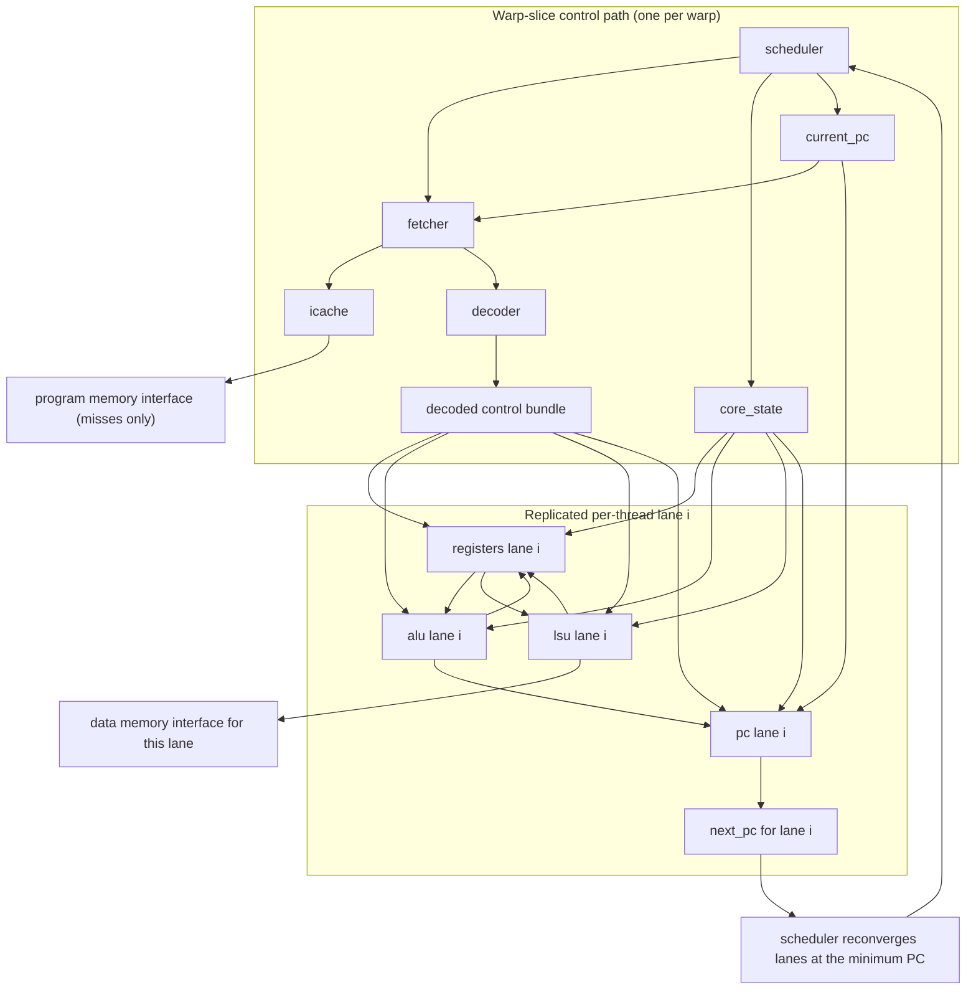

# Core Module

Source: `src/core.sv`

## What this module is

`core.sv` is the main compute engine for one block of threads. If the smaller module docs explain the **parts**, this file explains how those parts are assembled into one working SIMT core.

The key mental model is this:

- the block's threads are partitioned into **warps** of `THREADS_PER_WARP` lanes
- each warp gets **one shared control path** (fetcher + icache + decoder + scheduler)
- each thread lane gets **its own replicated datapath** (registers, alu, lsu, pc)

So the core behaves like **one or more independent instruction streams, each controlling several per-thread datapaths in parallel**. With the default `THREADS_PER_WARP = THREADS_PER_BLOCK` the whole block is a single warp — the classic tiny-gpu shape. With a smaller warp size, multiple warps run concurrently and hide each other's memory latency (real-GPU warp scheduling).

## Where it sits in tiny-gpu

- **Upstream:** `dispatch.sv` starts the core on a specific block and tells it `block_id` and `thread_count`
- **Inside the core:**
  - per-warp-slice modules: `fetcher`, `icache`, `decoder`, `scheduler`
  - per-thread modules: `registers`, `alu`, `lsu`, `pc`
  - per-core modules: banked `shared_memory` island, cross-warp barrier coordinator
- **Downstream:**
  - program-memory controller sees one fetch channel per warp slice (misses only, thanks to the icache)
  - data-memory controller sees LSU traffic
  - dispatcher sees `done` (AND of all warps' done)

## Clock/reset and when work happens

- Entire module is synchronous through its submodules
- `reset` resets the whole core and all its internal submodules
- `start` tells the scheduler to begin executing the assigned block
- The scheduler drives the per-instruction rhythm using `core_state`

## Interface cheat sheet

| Group | Meaning |
|---|---|
| `start`, `done` | per-block launch and completion handshake |
| `block_id`, `thread_count` | metadata for the currently assigned block |
| `program_mem_*[w]` | one instruction-fetch channel per warp slice (behind that slice's icache) |
| `data_mem_read_*`, `data_mem_write_*` | per-thread data-memory interfaces for LSU traffic |
| `core_state[w]`, `instruction[w]`, decoded bundles | per-warp control-path signals |
| `rs/rt`, `alu_out`, `lsu_out`, `next_pc` arrays | per-thread lane datapath signals |
| `perf_*` | aggregated performance counters (cycles, instrs, divergence, barrier, icache hits/misses) |

## Diagram


```mermaid
flowchart TD
    subgraph SharedControl["Warp-slice control path (one per warp)"]
        S["scheduler"] --> F["fetcher"]
        F --> IC["icache"]
        F --> D["decoder"]
        D --> CTRL["decoded control bundle"]
        S --> STAGE["core_state"]
        S --> CPC["current_pc"]
    end

    subgraph ThreadLanes["Replicated per-thread lane i"]
        R0["registers lane i"] --> A0["alu lane i"]
        R0 --> L0[lsu lane i]
        A0 --> R0
        L0 --> R0
        A0 --> P0["pc lane i"]
        P0 --> NPC["next_pc for lane i"]
    end

    CTRL --> R0
    CTRL --> A0
    CTRL --> L0
    CTRL --> P0
    STAGE --> R0
    STAGE --> A0
    STAGE --> L0
    STAGE --> P0
    CPC --> F
    CPC --> P0
    IC --> PMEM["program memory interface (misses only)"]
    L0 --> DMEM["data memory interface for this lane"]
    NPC --> MERGE["scheduler reconverges lanes at the minimum PC"]
    MERGE --> S
```

## How to read this file

This file is mostly an **integration file**. It does not invent a lot of new behavior. Instead, it answers these questions:

1. Which modules are shared per core?
2. Which modules are duplicated per thread lane?
3. How do the shared control signals fan out to all lanes?
4. How do the per-lane outputs feed back into shared control?

That is why `core.sv` has many wires/regs and many module instantiations, but relatively little algorithmic logic of its own.

## Behavior walkthrough

1. The dispatcher gives this core a `block_id` and `thread_count`.
2. Each warp slice's scheduler independently runs its warp's instruction lifecycle.
3. The warp's fetcher retrieves one instruction through its icache using the warp's `current_pc`.
4. The warp's decoder turns that instruction into control signals.
5. Those control signals are broadcast to **the active thread lanes of that warp**.
6. Inside each lane:
   - `registers` provides operands
   - `alu` computes arithmetic or compare results
   - `lsu` performs memory access if needed
   - `pc` computes that lane's `next_pc`
7. The warp's scheduler decides whether the warp is done or moves to its next instruction; the core is done when every warp is done.

## Shared path vs replicated path

This is the most important structural idea in the file.

### Per-warp-slice pieces

- `fetcher` (with speculative prefetch)
- `icache` (L1 instruction cache)
- `decoder`
- `scheduler`
- one `instruction` latch, one `current_pc`, one decoded control bundle

These exist once per *warp* because each warp executes its own instruction stream. With one warp per block they are effectively per-core, matching the original design.

### Replicated per-thread pieces

Inside the nested `generate` loops, every thread lane gets its own:

- `alu`
- `lsu`
- `registers`
- `pc`

This is how the same instruction can operate on different thread-local data at the same time. A lane's control signals come from its *owning warp's* decoded bundle — no cross-warp muxing is ever needed because lane-to-warp ownership is static (`warp = lane / THREADS_PER_WARP`).

### Per-core pieces

- the banked `shared_memory` island (all lanes of all warps share it — that is the point of `LDS`/`STS`)
- the cross-warp barrier coordinator: each warp scheduler reports `warp_at_barrier`; when every live warp of the block has arrived, the coordinator releases them all in the same cycle (retired warps are excluded so a barrier can never deadlock on a warp that already finished)

## The `generate` loop

The most important code pattern in this file is:

```sv
for (i = 0; i < THREADS_PER_BLOCK; i = i + 1) begin : threads
    ...
end
```

This does **not** mean "loop at runtime" the way a software `for` loop does.

It means:

- build hardware lane 0
- build hardware lane 1
- build hardware lane 2
- ...

So if `THREADS_PER_BLOCK = 4`, the generated hardware really contains 4 ALUs, 4 LSUs, 4 register files, and 4 PCs.

## Partial block handling

Not every block uses every physical lane.

That is why each thread-local module gets:

```sv
.enable(i < thread_count)
```

Meaning:

- if this is a full block, all lanes are enabled
- if this is the final partial block, only the first `thread_count` lanes are active

This is how one physical core can still execute a short last block safely.

## The key control model: min-PC reconvergence per warp

Look closely at this structure:

- each lane computes `next_pc[i]`
- the warp's scheduler tracks a per-lane `thread_pc` and executes the lanes parked at the warp's *minimum* PC each step

This is real branch-divergence support (not the original converged-PC simplification): lanes that branch ahead are frozen and automatically reconverge when the rest catch up. See [`scheduler.md`](./scheduler.md) for the full model.

So `core.sv` is the place where the SIMT execution hierarchy — block → warps → lanes — becomes most visible.

## Timing notes

- Source operand arrays `rs[i]`, `rt[i]` are filled by `registers.sv`
- `alu_out[i]`, `lsu_out[i]`, `next_pc[i]` are per-lane outputs consumed later in the instruction lifecycle
- Decoded signals are shared because the decoder runs once per core, not once per thread

## Common pitfalls

- Thinking `core.sv` contains the actual arithmetic/memory algorithms. Most of those live in submodules.
- Thinking the `generate` loop is software-style iteration. It is hardware replication.
- Forgetting that this core processes **one block at a time**, not one thread at a time — but the block's warps *do* run concurrently.
- Missing the difference between:
  - per-warp control state (`core_state[w]`, `instruction[w]`, `current_pc[w]`)
  - per-thread datapath state (`rs[i]`, `registers`, `lsu_state[i]`, `next_pc[i]`)

## Trace-it-yourself

Try tracing one `ADD` instruction for a block with 4 active threads:

1. Scheduler moves to `FETCH`
2. Fetcher returns one instruction word
3. Decoder produces one shared arithmetic-control bundle
4. All 4 register files snapshot their own `rs` and `rt`
5. All 4 ALUs compute in parallel
6. All 4 register files independently write back their own `alu_out`

Same instruction, different per-thread data.

## Read next

- [`gpu.md`](./gpu.md)
- [`scheduler.md`](./scheduler.md)
- [`registers.md`](./registers.md)
