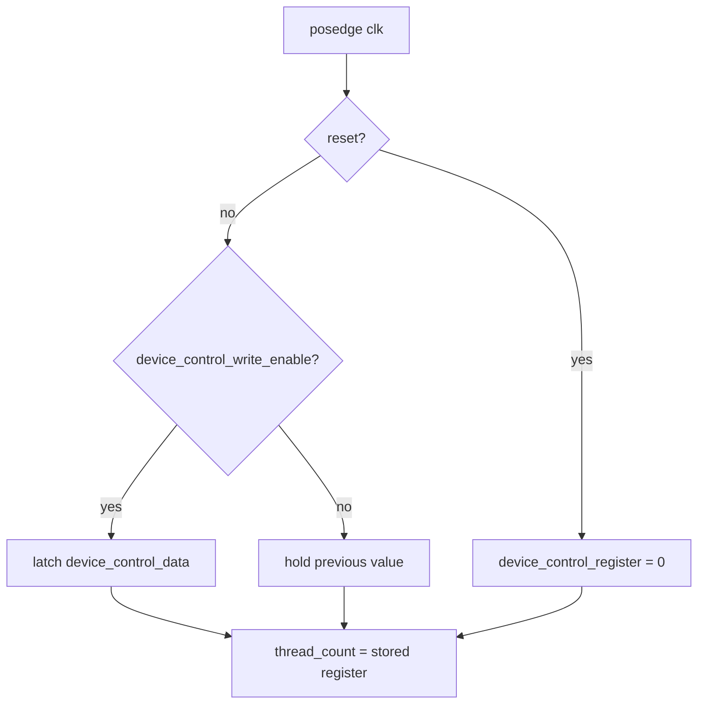

# DCR Module

Source: `src/dcr.sv`

## What this module is

`dcr.sv` is the Device Control Register. In this tiny GPU, it is a very small configuration module whose main job is to remember the total `thread_count` for the next kernel launch.

This is one of the simplest modules in the repo, but it is conceptually important because it shows how software/testbench configuration becomes hardware state.

## Where it sits in tiny-gpu

- **Upstream:** host/testbench writes launch metadata through `device_control_write_enable` and `device_control_data`
- **Downstream:** `dispatch.sv` reads `thread_count`

## Clock/reset and when work happens

- Synchronous on `posedge clk`
- Reset clears the internal register to zero
- If `device_control_write_enable` is high, the module latches the new control value

## Interface cheat sheet

| Port group | Meaning |
|---|---|
| `device_control_write_enable` | host says "store this launch setting now" |
| `device_control_data` | 8-bit configuration payload |
| `thread_count` | current stored thread count for dispatch |

## Diagram

## Behavior walkthrough

1. The host/testbench chooses how many total threads the kernel should launch.
2. It drives `device_control_data` and asserts `device_control_write_enable`.
3. `dcr.sv` stores that byte internally.
4. The output `thread_count` continuously reflects the stored value.
5. Later, the dispatcher uses it to calculate how many blocks to issue.

## Decision logic to focus on

There is almost no state machine here. The important idea is simply:

- reset clears launch metadata
- write-enable updates launch metadata
- otherwise the last configuration is preserved

## Timing notes

- `thread_count` is not recomputed each time; it is just the stored register contents
- If software never writes the DCR after reset, the dispatcher sees zero threads

## Common pitfalls

- Overthinking it as a complex control block. It is really just a tiny configuration register.
- Forgetting that this register belongs to the GPU launch path, not to per-thread execution.

## Trace-it-yourself

If the testbench writes `8` into `device_control_data` with `device_control_write_enable = 1`, then after the clock edge `thread_count` becomes `8`. The dispatcher can then divide those 8 threads into blocks.

## Read next

- [`dispatch.md`](./dispatch.md)
- [`scheduler.md`](./scheduler.md)
