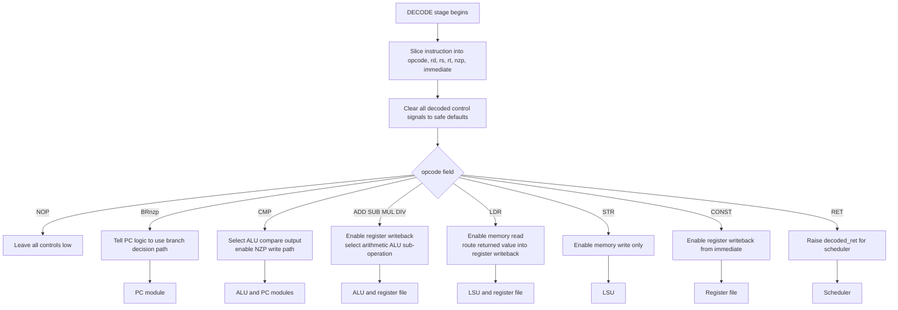

# Decoder Module

Source: `src/decoder.sv`

## What this module is

`decoder.sv` converts the raw 16-bit instruction into fields and control signals. It is the module that answers the question: **"What should the rest of the core do for this instruction?"**

DeepWiki describes the decoder as part of the core's shared control path. That is the right mental model: one decoder drives all active threads in a core at once.

## Where it sits in tiny-gpu

- **Upstream:** `fetcher.sv` provides `instruction`; `scheduler.sv` provides `core_state`
- **Downstream:** `registers.sv`, `alu.sv`, `lsu.sv`, `pc.sv`, and `scheduler.sv` all consume decoded signals

## Clock/reset and when work happens

- Synchronous on `posedge clk`
- Reset clears all remembered decode outputs
- Real decoding only happens in `DECODE` stage: `core_state == 3'b010`

## Interface cheat sheet

| Group | Meaning |
|---|---|
| `instruction` | the raw 16-bit instruction word |
| `decoded_rd/rs/rt_address` | register fields extracted from instruction bits |
| `decoded_nzp`, `decoded_immediate` | branch and immediate fields |
| `decoded_reg_write_enable` | register file should write in UPDATE |
| `decoded_mem_read_enable`, `decoded_mem_write_enable` | LSU should perform LDR/STR path |
| `decoded_alu_*` | ALU should do arithmetic or compare path |
| `decoded_pc_mux` | PC should use branch logic |
| `decoded_ret` | scheduler should finish block execution |

## Diagram

## Behavior walkthrough

1. The fetcher has already captured the current instruction.
2. In `DECODE`, the decoder slices reusable bit fields out of that instruction.
3. It then resets all control outputs to zero.
4. Based on the opcode, it asserts only the control bits needed by that instruction.
5. Those control bits will influence other modules in later stages.

## Decision logic to focus on

The most important design pattern here is:

1. extract fields
2. clear all controls
3. set only what the selected opcode needs

That avoids stale control signals leaking from the previous instruction.

## Timing notes

- The decoder does not itself perform arithmetic, memory access, or branching
- It only prepares control information for later stages
- Several instruction formats reuse the same raw bit slices differently, which is normal in instruction-set design

## Common pitfalls

- Thinking "decode" and "execute" are the same moment. They are separate stages.
- Forgetting to notice the default-zero control pattern.
- Reading `decoded_immediate` as meaningful for every opcode. It is only used when relevant.

## Trace-it-yourself

Take `LDR R4, R4`:

1. The decoder extracts `rd = R4`, `rs = R4`
2. It clears all controls
3. It asserts:
   - `decoded_reg_write_enable = 1`
   - `decoded_reg_input_mux = MEMORY`
   - `decoded_mem_read_enable = 1`
4. Later the LSU performs the load, and the register file writes the loaded value into `R4`

## Read next

- [`scheduler.md`](./scheduler.md)
- [`registers.md`](./registers.md)
- [`lsu.md`](./lsu.md)
