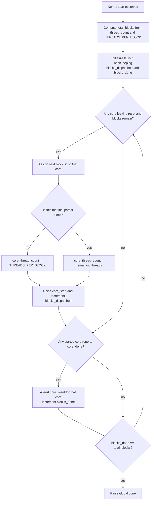

# Dispatch Module

Source: `src/dispatch.sv`

## What this module is

`dispatch.sv` is the kernel-level work distributor. It takes one total `thread_count`, turns that into blocks, and hands those blocks to available cores.

DeepWiki's execution-model and hardware-module pages describe the dispatcher as the block manager between the host configuration and the cores. That is exactly the right way to read this file.

## Where it sits in tiny-gpu

- **Upstream:** `dcr.sv` provides `thread_count`; external launch logic provides `start`
- **Downstream:** cores receive `core_start`, `core_reset`, `core_block_id`, `core_thread_count`
- **Feedback:** cores return `core_done`

## Clock/reset and when work happens

- Synchronous on `posedge clk`
- Reset clears completion counters and puts all cores into reset
- Once `start` is observed, dispatch begins managing block assignment until all blocks are done

## Interface cheat sheet

| Group | Meaning |
|---|---|
| `start` | launch this kernel |
| `thread_count` | total threads requested for the kernel |
| `core_done[]` | each core reports when its current block is complete |
| `core_start[]` | tells a core to begin its assigned block |
| `core_reset[]` | resets a core between blocks |
| `core_block_id[]` | which block the core is executing |
| `core_thread_count[]` | how many threads are active in that block |
| `done` | whole kernel is finished |

## Diagram

## Behavior walkthrough

1. It computes `total_blocks = ceil(thread_count / THREADS_PER_BLOCK)`.
2. It tracks two counters:
   - `blocks_dispatched`
   - `blocks_done`
3. When a core is available, the dispatcher gives it the next `block_id`.
4. For most blocks, `core_thread_count` equals `THREADS_PER_BLOCK`.
5. For the final block, `core_thread_count` may be smaller if the thread count does not divide evenly.
6. When a core reports `core_done`, the dispatcher resets that core so it can receive more work.
7. When `blocks_done == total_blocks`, it raises global `done`.

## Control idea to focus on

This file is not a deep per-cycle datapath. It is a **global work-accounting module**.

The two core questions it answers are:

- How many blocks exist?
- Which core should get the next block?

## Timing notes

- `start_execution` is a small helper flag used to treat level-sensitive `start` more like a one-time launch event
- `core_reset` is used both after global reset and between completed blocks
- A partially full last block matters because the core still has full physical resources, but some thread lanes must stay disabled

## Common pitfalls

- Confusing `thread_count` with `THREADS_PER_BLOCK`
- Forgetting the final block can be smaller
- Thinking one core equals one thread; one core actually processes one **block** at a time

## Trace-it-yourself

If `THREADS_PER_BLOCK = 4` and `thread_count = 10`:

- `total_blocks = 3`
- block 0 has 4 threads
- block 1 has 4 threads
- block 2 has 2 threads

That last value is what eventually becomes `core_thread_count` for the final issued block.

## Read next

- [`dcr.md`](./dcr.md)
- [`scheduler.md`](./scheduler.md)
- [`registers.md`](./registers.md)
