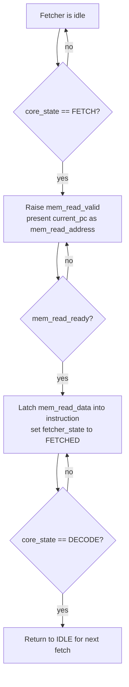

# Fetcher Module

Source: `src/fetcher.sv`

## What this module is

`fetcher.sv` fetches the next instruction from program memory. Each core has one fetcher because all active threads in a core share the same current instruction stream.

In DeepWiki's execution model, this is the module responsible for the `FETCH` stage of the core lifecycle.

## Where it sits in tiny-gpu

- **Upstream:** `scheduler.sv` provides `core_state` and `current_pc`
- **Downstream:** `decoder.sv` consumes `instruction`
- **Memory path:** program memory request goes through the program-memory controller

## Clock/reset and when work happens

- Synchronous on `posedge clk`
- Reset returns the fetcher to `IDLE`
- It launches a read only during the core's `FETCH` stage

## Interface cheat sheet

| Group | Meaning |
|---|---|
| `core_state`, `current_pc` | scheduler tells the fetcher what stage it is in and what address to fetch |
| `mem_read_valid`, `mem_read_address` | outgoing instruction-memory request |
| `mem_read_ready`, `mem_read_data` | memory/controller response |
| `fetcher_state` | local FSM state |
| `instruction` | latched fetched instruction |

## Diagram

## Behavior walkthrough

1. While idle, the fetcher watches for `core_state == FETCH`.
2. When that happens, it raises `mem_read_valid` and presents `current_pc` as the address.
3. It waits for program memory to respond.
4. When `mem_read_ready` arrives, it latches `mem_read_data` into `instruction`.
5. It then waits for the core to move into `DECODE`, which marks that this fetch cycle is complete.

## State machine idea

- `IDLE`: waiting for a new fetch request
- `FETCHING`: request is active, waiting for instruction return
- `FETCHED`: instruction has been captured and is ready for decode

## Timing notes

- `instruction` is stored in a register, so the decoder reads a stable value next stage
- The fetcher and scheduler are coordinated by `core_state`
- This design deliberately keeps fetching simple: one instruction at a time, no instruction cache here

## Common pitfalls

- Thinking `mem_read_ready` means "memory is idle." Here it means the fetch completed.
- Forgetting that the fetcher waits for `DECODE` before resetting its own state.
- Confusing data memory and program memory paths; this module uses only program memory.

## Trace-it-yourself

Suppose `current_pc = 9`:

1. Scheduler enters `FETCH`
2. Fetcher outputs `mem_read_valid = 1`, `mem_read_address = 9`
3. Later `mem_read_ready = 1` and the instruction word returns
4. Fetcher stores that instruction and moves to `FETCHED`
5. Once scheduler enters `DECODE`, fetcher returns to `IDLE`

## Read next

- [`decoder.md`](./decoder.md)
- [`scheduler.md`](./scheduler.md)
- [`controller.md`](./controller.md)
