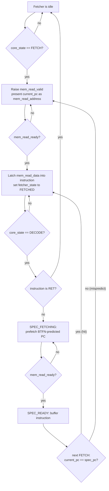

# Fetcher Module

Source: `src/fetcher.sv`

## What this module is

`fetcher.sv` fetches the next instruction from program memory (through the per-warp-slice L1 instruction cache, `icache.sv`). Each warp slice has one fetcher because all active threads in a warp share the same current instruction stream.

In DeepWiki's execution model, this is the module responsible for the `FETCH` stage of the core lifecycle — but it is now a **pipelined front-end**: while the warp executes the current instruction, the fetcher speculatively prefetches the predicted next one, so a correct prediction turns the next `FETCH` stage into a single cycle.

## Where it sits in tiny-gpu

- **Upstream:** `scheduler.sv` provides `core_state` and `current_pc`
- **Downstream:** `decoder.sv` consumes `instruction`
- **Memory path:** requests go to the warp slice's `icache.sv`; only cache misses continue to the program-memory controller

## Clock/reset and when work happens

- Synchronous on `posedge clk`
- Reset returns the fetcher to `IDLE`
- It launches a read only during the core's `FETCH` stage

## Interface cheat sheet

| Group | Meaning |
|---|---|
| `core_state`, `current_pc` | scheduler tells the fetcher what stage it is in and what address to fetch |
| `mem_read_valid`, `mem_read_address` | outgoing instruction-memory request |
| `mem_read_ready`, `mem_read_data` | memory/controller response |
| `fetcher_state` | local FSM state |
| `instruction` | latched fetched instruction |

## Diagram

```mermaid
flowchart TD
    A["Fetcher is idle"] --> B{"core_state == FETCH?"}
    B -- no --> A
    B -- yes --> C["Raise mem_read_valid<br/>present current_pc as mem_read_address"]
    C --> D{"mem_read_ready?"}
    D -- no --> C
    D -- yes --> E["Latch mem_read_data into instruction<br/>set fetcher_state to FETCHED"]
    E --> F{"core_state == DECODE?"}
    F -- no --> E
    F -- yes --> G{"instruction is RET?"}
    G -- yes --> A
    G -- no --> H["SPEC_FETCHING:<br/>prefetch BTFN-predicted PC"]
    H --> I{"mem_read_ready?"}
    I -- no --> H
    I -- yes --> J["SPEC_READY: buffer instruction"]
    J --> K{"next FETCH:<br/>current_pc == spec_pc?"}
    K -- "yes (hit)" --> E
    K -- "no (mispredict)" --> C
```

## Behavior walkthrough

1. While idle, the fetcher watches for `core_state == FETCH`.
2. When that happens, it raises `mem_read_valid` and presents `current_pc` as the address.
3. It waits for the icache to respond (a hit responds in ~1 cycle; a miss pays the program-memory round trip).
4. When `mem_read_ready` arrives, it latches `mem_read_data` into `instruction`.
5. When the core moves into `DECODE`, the fetch port is free again — so the fetcher immediately starts a **speculative prefetch** of the predicted next PC (static BTFN: a `BRnzp` with a backward target is predicted taken as a loop edge, everything else predicted `PC + 1`). It does not speculate past a `RET`.
6. On the next `FETCH`, a correct prediction is served from the speculation buffer in a single cycle; a mispredict is discarded and refetched as a normal demand fetch.

## State machine idea

- `IDLE`: waiting for a new fetch request
- `FETCHING`: demand request active, waiting for instruction return
- `FETCHED`: instruction has been captured and is ready for decode
- `SPEC_FETCHING`: speculative prefetch in flight while the warp executes
- `SPEC_READY`: predicted instruction buffered, waiting for the next `FETCH` to confirm or discard it

## Timing notes

- `instruction` is stored in a register, so the decoder reads a stable value next stage
- The fetcher and scheduler are coordinated by `core_state`
- Speculation is safe because program-memory reads are side-effect free; a wrong guess costs nothing but the refetch it would have needed anyway

## Common pitfalls

- Thinking `mem_read_ready` means "memory is idle." Here it means the fetch completed.
- Forgetting that after `FETCHED` the fetcher moves into speculation (`SPEC_FETCHING`), not back to `IDLE` — `IDLE` is only re-entered after a `RET` or a discarded in-flight speculation.
- Confusing data memory and program memory paths; this module uses only program memory (via the icache).

## Trace-it-yourself

Suppose `current_pc = 9` and instruction 9 is not a branch:

1. Scheduler enters `FETCH`
2. Fetcher outputs `mem_read_valid = 1`, `mem_read_address = 9`
3. Later `mem_read_ready = 1` and the instruction word returns
4. Fetcher stores that instruction and moves to `FETCHED`
5. Once scheduler enters `DECODE`, the fetcher predicts `PC + 1 = 10` and starts prefetching it (`SPEC_FETCHING` → `SPEC_READY`)
6. When the scheduler next enters `FETCH` with `current_pc = 10`, the buffered instruction is delivered in one cycle

## Read next

- [`decoder.md`](./decoder.md)
- [`scheduler.md`](./scheduler.md)
- [`controller.md`](./controller.md)
