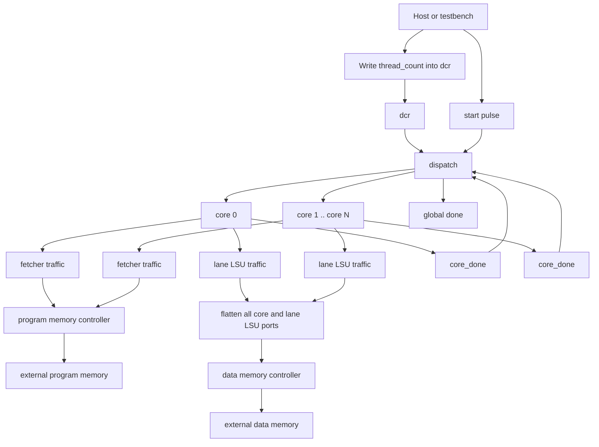

# GPU Module

Source: `src/gpu.sv`

## What this module is

`gpu.sv` is the top-level integration module for the whole design. It does not mainly perform arithmetic or decode instructions itself. Instead, it connects all major subsystems into one complete GPU.

The best beginner mental model is:

> `gpu.sv` is the top-level wiring and orchestration shell.

It ties together:

- launch configuration (`dcr`)
- block assignment (`dispatch`)
- memory arbitration (`controller`)
- actual execution (`core` instances)

This matches the DeepWiki architecture pages, where the GPU module is described as the wrapper around cores, memory controllers, and dispatch logic.

## Where it sits in tiny-gpu

- **Upstream:** host/testbench drives `start`, `device_control_write_enable`, and the external memory interfaces
- **Inside the GPU:**
  - one `dcr`
  - one data-memory controller
  - one program-memory controller
  - one `dispatch`
  - `NUM_CORES` compute cores
- **Downstream:** external data/program memory ports and the host-visible `done`

## Clock/reset and when work happens

- Entire design is clocked by `clk`
- `reset` resets the top-level submodules and their children
- Execution begins only after:
  1. the host loads memory
  2. the host writes thread count into the DCR
  3. the host asserts `start`

## Interface cheat sheet

| Group | Meaning |
|---|---|
| `start`, `done` | top-level kernel launch and completion |
| `device_control_*` | host writes launch metadata into the DCR |
| `program_mem_*` | external program memory interface |
| `data_mem_*` | external data memory interface |
| `core_*` arrays | dispatcher-managed per-core launch/status signals |
| `lsu_*` arrays | flattened all-core/all-thread data-memory traffic |
| `fetcher_*` arrays | per-core instruction-fetch traffic |

## Diagram



## How to read this file

This file is mostly about **connectivity**, not local algorithms.

When reading it, ask these questions:

1. Which modules exist once at GPU scope?
2. Which modules are instantiated once per core?
3. How are per-core and per-thread signals flattened so the memory controllers can see them?
4. How does the launch flow move from host -> DCR -> dispatch -> core?

## Behavior walkthrough

1. The host writes `thread_count` into `dcr`.
2. The host asserts `start`.
3. `dispatch` uses `thread_count` to break the kernel into blocks and assign those blocks to cores.
4. Each core runs one block at a time.
5. Core fetchers request instructions through the program-memory controller.
6. Core LSUs request data-memory reads/writes through the data-memory controller.
7. As cores finish blocks, `dispatch` either assigns new blocks or eventually raises global `done`.

## The most important structural idea: flattening

Inside a core, LSU traffic is naturally grouped as:

- per core
- per thread lane

But the controller wants one flat list of consumers.

So `gpu.sv` creates flattened arrays such as:

- `lsu_read_valid[NUM_LSUS-1:0]`
- `lsu_write_valid[NUM_LSUS-1:0]`

where:

```text
NUM_LSUS = NUM_CORES * THREADS_PER_BLOCK
```

Then it bridges each core-local lane into a unique global LSU index:

```text
lsu_index = i * THREADS_PER_BLOCK + j
```

That indexing rule is one of the most important things to understand in this file.

## One-instance modules vs replicated modules

### Single GPU-wide instances

- `dcr`
- `dispatch`
- one data-memory controller
- one program-memory controller

These exist once because they coordinate global behavior.

### Repeated per-core instances

Inside the `generate` loop, `gpu.sv` instantiates one `core` per `i`.

So if `NUM_CORES = 2`, the generated hardware contains two compute cores.

## The bridging logic

Inside the nested `generate` structure, the file creates per-core local LSU wires like:

- `core_lsu_read_valid`
- `core_lsu_read_address`

Then it copies them into the flattened global arrays seen by the controller.

This is integration glue. It is not new GPU behavior by itself, but it is essential for wiring the hierarchical design together.

The comments mention OpenLane / Verilog-2005 compatibility. That tells you this structure is partly shaped by tool constraints, not just by pure architectural elegance.

## The full launch path

The top-level flow is:

1. host writes launch metadata into `dcr`
2. `dcr` exposes `thread_count`
3. `dispatch` turns `thread_count` into blocks and per-core start/reset signals
4. each `core` executes its assigned block
5. fetch and memory access are arbitrated by the controllers
6. once all blocks finish, `dispatch` raises `done`

This is the main reason `gpu.sv` feels more like a system diagram than a small algorithmic module.

## Timing notes

- Memory requests do not go directly from cores to external memory; they pass through controllers
- `core_done[i]` feeds back into dispatch so new blocks can be issued dynamically
- `start` is consumed by `dispatch`, not broadcast directly as full execution control into every submodule

## Common pitfalls

- Expecting `gpu.sv` to contain the execution logic itself. Most real behavior lives in submodules.
- Getting lost in the many arrays without first separating them into:
  - host interface
  - per-core control
  - flattened fetch traffic
  - flattened LSU traffic
- Forgetting that `gpu.sv` must bridge **hierarchical structure** into **controller-friendly flat arrays**.
- Confusing per-core repetition with per-thread repetition. `gpu.sv` duplicates cores; `core.sv` duplicates thread lanes.

## Trace-it-yourself

Suppose `NUM_CORES = 2` and `THREADS_PER_BLOCK = 4`:

- there are 2 core instances
- there are `2 * 4 = 8` flattened LSU consumer slots
- one core's lane 0 might map to flattened LSU index 0
- the other core's lane 0 might map to flattened LSU index 4

This is how one shared data-memory controller can serve all thread-local LSUs across all cores.

## Read next

- [`core.md`](./core.md)
- [`dispatch.md`](./dispatch.md)
- [`controller.md`](./controller.md)
