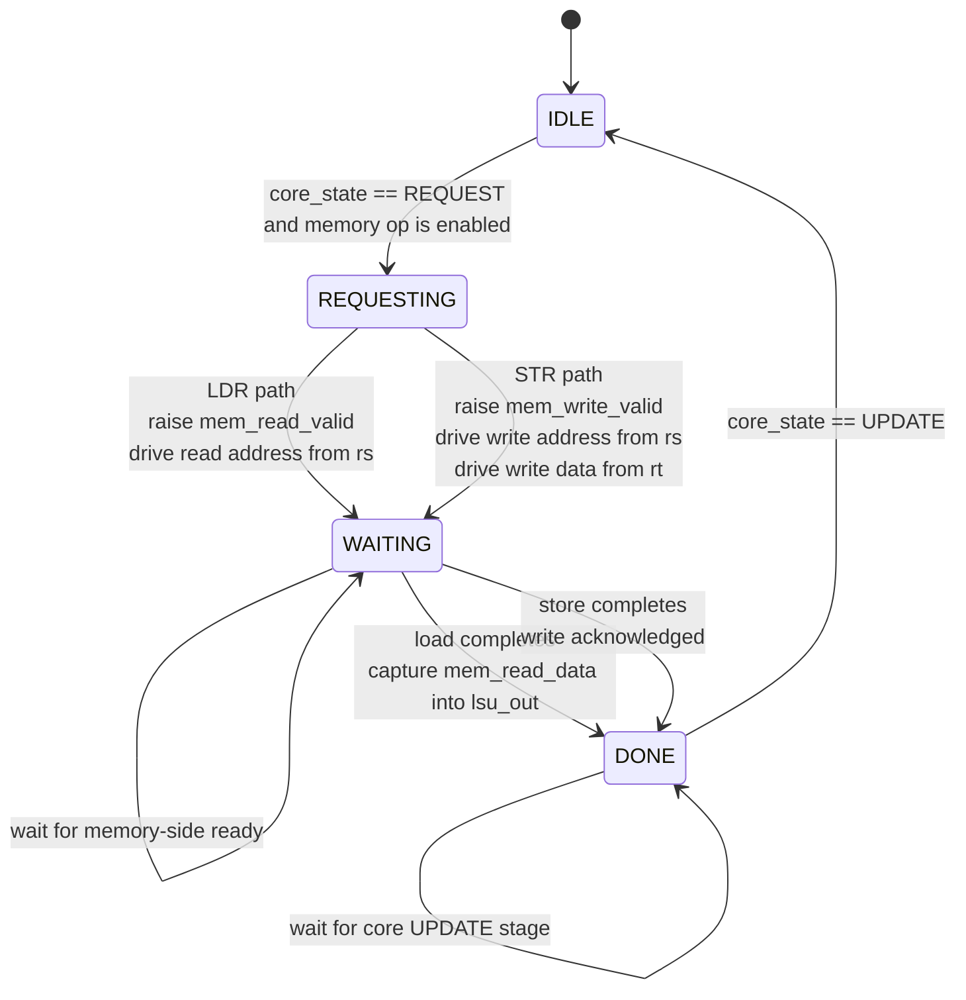

# LSU Module

Source: `src/lsu.sv`

## What this module is

`lsu.sv` is the per-thread Load/Store Unit. Each active thread lane has its own LSU so memory accesses can be tracked independently.

This is one of the clearest places to learn why the scheduler has a `WAIT` stage: memory requests take longer than simple arithmetic.

## Where it sits in tiny-gpu

- **Upstream:** `decoder.sv` says whether the instruction is `LDR` or `STR`; `registers.sv` supplies `rs` and `rt`
- **Downstream:** data memory controller receives the request; `registers.sv` may later write back `lsu_out`

## Clock/reset and when work happens

- Synchronous on `posedge clk`
- Reset clears request state and handshake outputs
- Memory requests are launched starting around the core's `REQUEST` stage and completed before leaving `WAIT`

## Interface cheat sheet

| Group | Meaning |
|---|---|
| `decoded_mem_read_enable`, `decoded_mem_write_enable` | select LDR vs STR behavior |
| `rs` | memory address |
| `rt` | store data for STR |
| `mem_read_*`, `mem_write_*` | external memory handshake |
| `lsu_state` | local FSM state |
| `lsu_out` | loaded data for later writeback |

## Diagram

## Behavior walkthrough

1. The decoder chooses whether this instruction is a load or store.
2. In `REQUEST`, the LSU begins the transaction.
3. In `REQUESTING`, it drives either:
   - read address (`LDR`)
   - write address + write data (`STR`)
4. In `WAITING`, it waits for the controller/memory to acknowledge completion.
5. For a load, it captures returned data into `lsu_out`.
6. In `DONE`, it waits until `UPDATE` before resetting back to `IDLE`.

## State machine idea

- `IDLE`: no memory op in flight
- `REQUESTING`: presenting a fresh request
- `WAITING`: request has been sent, waiting for completion
- `DONE`: completion reached, waiting for the core's per-instruction cleanup point

The same FSM is reused for both loads and stores; only the handshake signals differ.

## Timing notes

- This module is the reason the scheduler must sometimes stall in `WAIT`
- `lsu_out` is only meaningful after a load has completed
- Returning to `IDLE` in `UPDATE` keeps the per-instruction rhythm aligned with the rest of the core

## Common pitfalls

- Thinking memory requests finish in one cycle like ALU operations
- Forgetting that `rs` is used as the memory address in this design
- Missing that `lsu_out` is only for `LDR`, not `STR`

## Trace-it-yourself

For `LDR R4, R4`:

1. Register file has already copied `R4` into `rs`
2. LSU enters `REQUESTING` and drives `mem_read_address = rs`
3. It waits in `WAITING`
4. When `mem_read_ready` is asserted, it stores `mem_read_data` into `lsu_out`
5. In `UPDATE`, the register file writes `lsu_out` into `R4`

## Read next

- [`controller.md`](./controller.md)
- [`scheduler.md`](./scheduler.md)
- [`registers.md`](./registers.md)
