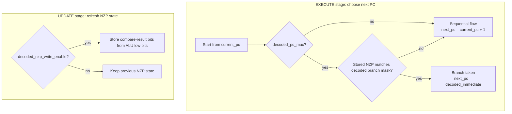

# PC Module

Source: `src/pc.sv`

## What this module is

`pc.sv` computes the next program counter for one thread lane and stores that lane's NZP condition state.

This module is where the tiny-gpu branch mechanism comes together:

- `decoder.sv` says whether the instruction is a branch
- `alu.sv` computes compare flags for `CMP`
- `pc.sv` decides whether to take the branch and where to go next

## Where it sits in tiny-gpu

- **Upstream:** decoder provides `decoded_pc_mux`, `decoded_nzp`, `decoded_immediate`, and `decoded_nzp_write_enable`; ALU provides `alu_out`
- **Downstream:** scheduler later chooses one representative `next_pc` value as the core's shared `current_pc`

## Clock/reset and when work happens

- Synchronous on `posedge clk`
- Reset clears both `nzp` and `next_pc`
- Two important stages:
  - `EXECUTE`: compute `next_pc`
  - `UPDATE`: refresh `nzp` from compare output if needed

## Interface cheat sheet

| Group | Meaning |
|---|---|
| `current_pc` | current converged PC from the scheduler |
| `decoded_pc_mux` | whether to use branch logic or plain PC+1 |
| `decoded_nzp`, `decoded_immediate` | branch condition mask and branch target |
| `decoded_nzp_write_enable` | whether this instruction updates NZP |
| `alu_out` | low 3 bits carry compare results for CMP |
| `next_pc` | this thread lane's computed next PC |

## Diagram

## Behavior walkthrough

1. During `EXECUTE`, the PC logic decides what the next instruction address should be.
2. If this is not a branch instruction, it simply does `current_pc + 1`.
3. If this is `BRnzp`, it checks whether the stored `nzp` bits match the branch mask.
4. If they match, it jumps to `decoded_immediate`.
5. Separately, in `UPDATE`, a previous `CMP` can refresh the stored `nzp` bits from `alu_out[2:0]`.

## Decision logic to focus on

- Branch selection is based on `decoded_pc_mux`
- Branch condition is based on `(nzp & decoded_nzp) != 0`
- NZP update happens later than compare execution

That last point is crucial: compare result generation and NZP state update are not the same moment.

## Timing notes

- `CMP` produces the bits in the ALU during `EXECUTE`
- `pc.sv` stores those bits into `nzp` during `UPDATE`
- A future branch reads the stored `nzp` state

## Common pitfalls

- Thinking the immediate is always used as the next PC. It is only used when a branch is taken.
- Forgetting that `nzp` is stateful and persists across instructions.
- Missing the repo's simplifying assumption: each thread lane computes a `next_pc`, but the scheduler later assumes all lanes converge.

## Trace-it-yourself

Imagine `CMP R9, R2` followed by `BRn LOOP`:

1. `CMP` causes ALU to pack gt/eq/lt bits into `alu_out[2:0]`
2. In `UPDATE`, PC module stores those bits into `nzp`
3. On the later branch instruction, `decoded_pc_mux = 1`
4. If the negative bit matches the branch mask, `next_pc` becomes the loop label address

## Read next

- [`alu.md`](./alu.md)
- [`decoder.md`](./decoder.md)
- [`scheduler.md`](./scheduler.md)
