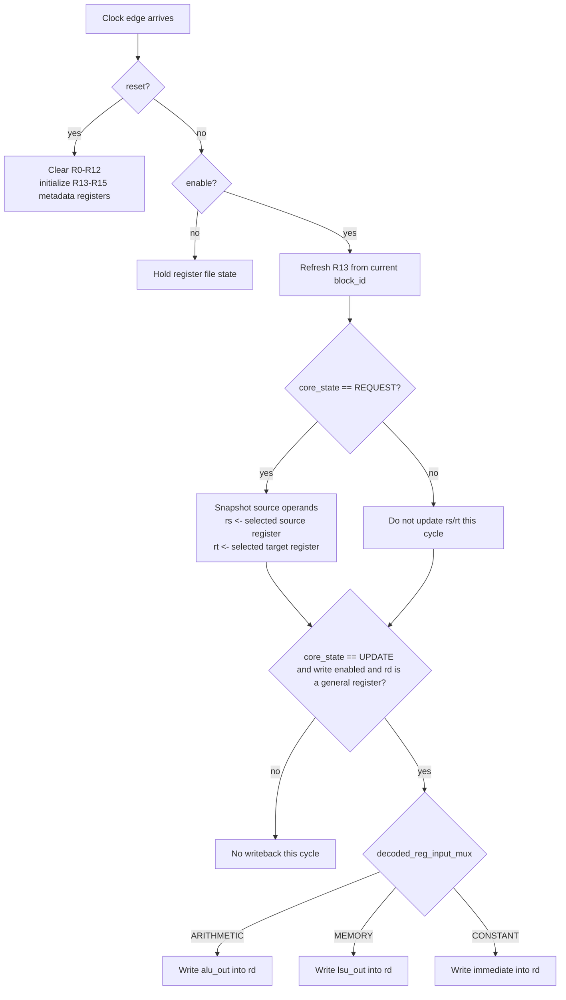

# Registers Module

Source: `src/registers.sv`

## What this module is

`registers.sv` is the per-thread register file. Each thread lane gets its own private set of 16 registers, which is one of the main reasons SIMD execution works: all threads execute the same instruction, but each thread reads and writes its own data.

DeepWiki's thread-unit description highlights the special metadata registers here. They are especially important for understanding `blockIdx * blockDim + threadIdx`.

## Where it sits in tiny-gpu

- **Upstream:** decoder provides register addresses and writeback controls; ALU/LSU/immediate paths provide candidate writeback data
- **Downstream:** ALU and LSU consume `rs` and `rt`

## Clock/reset and when work happens

- Synchronous on `posedge clk`
- Reset clears general registers and initializes special registers
- Important stages:
  - `REQUEST`: read source operands into `rs` and `rt`
  - `UPDATE`: write result into `rd`

## Interface cheat sheet

| Group | Meaning |
|---|---|
| `decoded_rd/rs/rt_address` | which registers to write/read |
| `decoded_reg_write_enable` | whether UPDATE should write into `rd` |
| `decoded_reg_input_mux` | choose ALU result, memory result, or immediate |
| `alu_out`, `lsu_out`, `decoded_immediate` | writeback sources |
| `block_id` | current block index from dispatch/core |
| `rs`, `rt` | source operand outputs for this thread lane |

## Diagram

## Behavior walkthrough

1. On reset, it clears the general-purpose registers.
2. It initializes:
   - `R13 = %blockIdx`
   - `R14 = %blockDim`
   - `R15 = %threadIdx`
3. While enabled, it keeps `R13` synchronized with the current `block_id`.
4. In `REQUEST`, it snapshots the source registers named by the current instruction into `rs` and `rt`.
5. In `UPDATE`, if writeback is enabled and `rd < 13`, it writes one of three sources into `rd`.

## Decision logic to focus on

- Source read timing is stage-based, not asynchronous
- Writeback uses a 3-way mux
- Special metadata registers are protected by `decoded_rd_address < 13`

## Timing notes

- `rs` and `rt` are registers themselves, not direct array aliases
- The module reads in `REQUEST` and writes in `UPDATE`
- That staged rhythm is what keeps operand use and result commit aligned with the rest of the core

## Common pitfalls

- Thinking `R13-R15` are normal writable registers. They are treated as read-only metadata.
- Forgetting that `%blockIdx` is refreshed from `block_id`.
- Missing that the source operands are copied out into `rs` and `rt` before ALU/LSU use.

## Trace-it-yourself

For `CONST R2, #8`:

1. Decoder sets `decoded_reg_write_enable = 1`
2. Decoder sets `decoded_reg_input_mux = CONSTANT`
3. In `UPDATE`, register file writes `decoded_immediate` into `R2`

For `ADD R6, R4, R5`:

1. In `REQUEST`, it copies `R4 -> rs`, `R5 -> rt`
2. ALU uses those values in `EXECUTE`
3. In `UPDATE`, it writes `alu_out` into `R6`

## Read next

- [`alu.md`](./alu.md)
- [`lsu.md`](./lsu.md)
- [`pc.md`](./pc.md)
