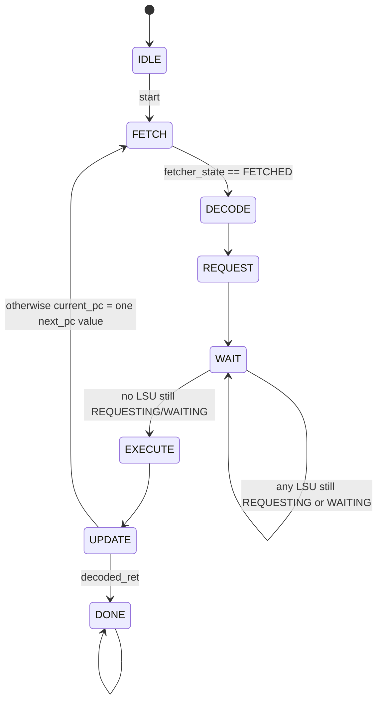

# Scheduler Module

Source: `src/scheduler.sv`

## What this module is

`scheduler.sv` is the core's master stage machine. If you want one file that explains the overall execution rhythm of a block, this is the file.

DeepWiki's execution-model page describes the six-stage flow `FETCH -> DECODE -> REQUEST -> WAIT -> EXECUTE -> UPDATE`. This module is exactly where that flow is enforced.

## Where it sits in tiny-gpu

- **Upstream:** `dispatch.sv` provides `start`; fetcher and LSUs report progress
- **Downstream:** all other core-local modules react to `core_state`
- **Key idea:** `core_state` is the shared control clocking rhythm for the whole core

## Clock/reset and when work happens

- Synchronous on `posedge clk`
- Reset sets `current_pc = 0`, `core_state = IDLE`, `done = 0`
- Every instruction executed by a block passes through the same state sequence

## Interface cheat sheet

| Group | Meaning |
|---|---|
| `start` | begin processing this block |
| `fetcher_state` | tells scheduler when instruction fetch completed |
| `lsu_state[]` | tells scheduler whether any thread is still waiting on memory |
| `decoded_ret` | end-of-kernel/block instruction marker |
| `next_pc[]` | each thread lane's computed next PC |
| `core_state` | shared stage broadcast to the core |
| `current_pc` | the core's converged PC |
| `done` | this block has finished executing |

## Diagram

## Behavior walkthrough

1. In `IDLE`, the scheduler waits for the core to be started on a new block.
2. `FETCH` waits until the fetcher reports that the instruction has arrived.
3. `DECODE` gives the decoder one cycle to produce control signals.
4. `REQUEST` lets registers/LSUs launch their work.
5. `WAIT` stalls if any LSU still has an in-flight memory operation.
6. `EXECUTE` is where ALUs and PC logic do their main calculations.
7. `UPDATE` commits results and either:
   - ends the block on `RET`
   - or advances to the next instruction

## State machine idea

- `IDLE`: no active block
- `FETCH`: instruction fetch in progress
- `DECODE`: instruction decode
- `REQUEST`: operand snapshot / memory request launch
- `WAIT`: memory-latency hiding point in this simple design
- `EXECUTE`: perform arithmetic/branch logic
- `UPDATE`: commit state updates
- `DONE`: block finished

## Timing notes

- `WAIT` is the key stage for understanding asynchronous memory
- The scheduler chooses `current_pc <= next_pc[THREADS_PER_BLOCK-1]` as a representative value, which encodes the repo's simplifying assumption that active threads reconverge to one PC
- `done` is asserted only when a `RET` instruction reaches `UPDATE`

The Mermaid diagram intentionally shows a self-loop on `WAIT` because that stage can last multiple cycles when any thread LSU still has an in-flight memory operation.

## Common pitfalls

- Thinking every instruction always spends many cycles in `WAIT`. Non-memory instructions pass through quickly.
- Missing that `decoded_ret` is handled in `UPDATE`, not immediately in `DECODE`.
- Forgetting the branch-divergence simplification when reading the `next_pc[]` array.

## Trace-it-yourself

For a non-memory `ADD` instruction, the rough rhythm is:

1. `FETCH` gets the instruction
2. `DECODE` produces arithmetic controls
3. `REQUEST` snapshots source operands
4. `WAIT` exits quickly because no LSU is busy
5. `EXECUTE` computes `alu_out`
6. `UPDATE` writes the result and advances `current_pc`

For `LDR`, the difference is that `WAIT` lasts until the matching LSU finishes.

## Read next

- [`decoder.md`](./decoder.md)
- [`fetcher.md`](./fetcher.md)
- [`lsu.md`](./lsu.md)
