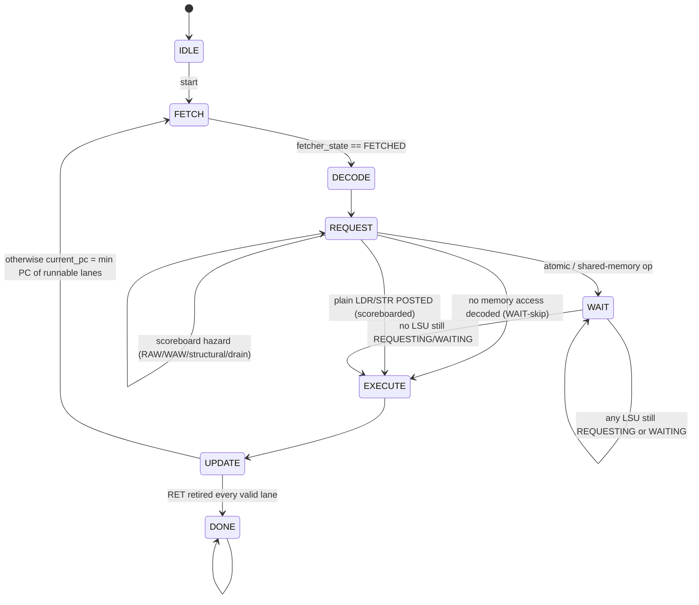

# Scheduler Module

Source: `src/scheduler.sv`

## What this module is

`scheduler.sv` is the warp's master stage machine. If you want one file that explains the overall execution rhythm of a warp, this is the file.

DeepWiki's execution-model page describes the six-stage flow `FETCH -> DECODE -> REQUEST -> WAIT -> EXECUTE -> UPDATE`. This module is exactly where that flow is enforced — with four industry-style extensions:

- **branch divergence** via per-lane PCs and min-PC reconvergence,
- **`WAIT`-skip** so non-memory instructions bypass the memory-wait stage,
- **scoreboarded issue**: plain global `LDR`/`STR` are *posted* — the warp keeps executing while the access is in flight, and only genuinely dependent instructions stall (RAW/WAW on the load destination, further memory ops, `RET`/`BAR` drains), and
- **block-wide barriers** (`BAR`) coordinated across all warps of the block.

Each warp slice of a core instantiates its own scheduler; with the default `THREADS_PER_WARP = THREADS_PER_BLOCK` there is exactly one per core, which is the classic tiny-gpu shape.

## Where it sits in tiny-gpu

- **Upstream:** `dispatch.sv` provides `start` (via the core); fetcher and LSUs report progress
- **Downstream:** all other warp-local modules react to `core_state`
- **Sideways:** exchanges `warp_at_barrier` / `barrier_release` with the core's cross-warp barrier coordinator
- **Key idea:** `core_state` is the shared control clocking rhythm for the whole warp

## Clock/reset and when work happens

- Synchronous on `posedge clk`
- Reset sets `current_pc = 0`, `core_state = IDLE`, `done = 0`
- Every instruction executed by a block passes through the same state sequence

## Interface cheat sheet

| Group | Meaning |
|---|---|
| `start` | begin processing this block |
| `fetcher_state` | tells scheduler when instruction fetch completed |
| `lsu_state[]` | tells scheduler whether any thread is still waiting on memory |
| `decoded_ret` | end-of-kernel/block instruction marker |
| `next_pc[]` | each thread lane's computed next PC |
| `core_state` | shared stage broadcast to the core |
| `current_pc` | the core's converged PC |
| `done` | this block has finished executing |

## Diagram

```mermaid
stateDiagram-v2
    [*] --> IDLE
    IDLE --> FETCH: start
    FETCH --> DECODE: fetcher_state == FETCHED
    DECODE --> REQUEST
    REQUEST --> REQUEST: scoreboard hazard (RAW/WAW/structural/drain)
    REQUEST --> EXECUTE: no memory access decoded (WAIT-skip)
    REQUEST --> EXECUTE: plain LDR/STR POSTED (scoreboarded)
    REQUEST --> WAIT: atomic / shared-memory op
    WAIT --> WAIT: any LSU still REQUESTING or WAITING
    WAIT --> EXECUTE: no LSU still REQUESTING/WAITING
    EXECUTE --> UPDATE
    UPDATE --> DONE: RET retired every valid lane
    UPDATE --> FETCH: otherwise current_pc = min PC of runnable lanes
    DONE --> DONE
```

## Behavior walkthrough

1. In `IDLE`, the scheduler waits for the core to be started on a new block.
2. `FETCH` waits until the fetcher reports that the instruction has arrived (a single cycle when the speculative prefetch guessed right).
3. `DECODE` gives the decoder one cycle to produce control signals.
4. `REQUEST` lets registers/LSUs launch their work. If the decoded instruction touches no memory, the scheduler skips straight to `EXECUTE`.
5. `WAIT` stalls if any LSU still has an in-flight memory operation.
6. `EXECUTE` is where ALUs and PC logic do their main calculations.
7. `UPDATE` commits results and either:
   - retires the active lanes on `RET` (the warp finishes once every valid lane has retired)
   - parks the active lanes on `BAR` until every live lane of the *block* arrives (cross-warp coordination)
   - or advances each active lane's PC and reconverges on the new minimum PC

## Divergence (min-PC reconvergence)

Every lane keeps its own `thread_pc[i]`. Each step, the scheduler selects the *minimum* PC among runnable lanes and executes exactly the lanes parked there (`active_mask`). Lanes that branched ahead stay frozen until the rest catch up, at which point they automatically fall back into the same active mask. Correct for structured control flow with no explicit IPDOM stack; `perf_divergence_count` ticks whenever the active lanes are a strict subset of the live lanes.

## Scoreboard (posted memory operations)

A plain global `LDR`/`STR` does not hold the warp in `WAIT`. At `REQUEST` it *posts*: the LSUs launch the access, the scoreboard records `{posted_rd, posted_mask, is_load}`, and the instruction retires its PC normally while the memory access continues in the background. The next instructions issue freely unless they hit an interlock at `REQUEST`:

- **RAW** — reads the posted load's destination register
- **WAW** — writes the posted load's destination register
- **structural** — is itself a memory op (one posted op per warp)
- **drain** — `RET`/`BAR` must wait for all posted work to land

Whether an instruction actually reads `rs`/`rt` is derived from the decoded control vector, so a `CONST`/`BRnzp` immediate that merely aliases a register index never falsely stalls. On completion the deferred register write commits through a dedicated posted write port (even if divergence has since masked the issuing lanes off), and the interlock releases one cycle later — so the dependent instruction always re-reads fresh operands. `perf_posted_count` counts posted ops.

## State machine idea

- `IDLE`: no active block
- `FETCH`: instruction fetch in progress
- `DECODE`: instruction decode
- `REQUEST`: operand snapshot / memory request launch
- `WAIT`: memory-latency wait (skipped entirely by non-memory instructions)
- `EXECUTE`: perform arithmetic/branch logic
- `UPDATE`: commit state updates
- `DONE`: block finished

## Timing notes

- `WAIT` is the key stage for understanding asynchronous memory
- `current_pc` and `active_mask` are combinational projections of the per-lane state: the minimum PC over lanes that are valid, not retired, and not parked at a barrier
- `done` is asserted only when every valid lane has retired via `RET`

The Mermaid diagram intentionally shows a self-loop on `WAIT` because that stage can last multiple cycles when any thread LSU still has an in-flight memory operation.

## Common pitfalls

- Thinking every instruction always spends cycles in `WAIT`. Non-memory instructions never even enter it.
- Missing that `decoded_ret` and `decoded_barrier` are handled in `UPDATE`, not immediately in `DECODE`.
- Forgetting that a fully-barrier-parked warp holds in `FETCH` without fetching until the coordinator releases it — that is what makes cross-warp `BAR` deadlock-free.

## Trace-it-yourself

For a non-memory `ADD` instruction, the rough rhythm is:

1. `FETCH` gets the instruction (1 cycle if the prefetch predicted it)
2. `DECODE` produces arithmetic controls
3. `REQUEST` snapshots source operands, then jumps straight to `EXECUTE` (WAIT-skip)
4. `EXECUTE` computes `alu_out`
5. `UPDATE` writes the result and advances each active lane's PC

For `LDR`, the difference is that `REQUEST` transitions into `WAIT`, which lasts until the matching LSU finishes.

## Read next

- [`decoder.md`](./decoder.md)
- [`fetcher.md`](./fetcher.md)
- [`lsu.md`](./lsu.md)
