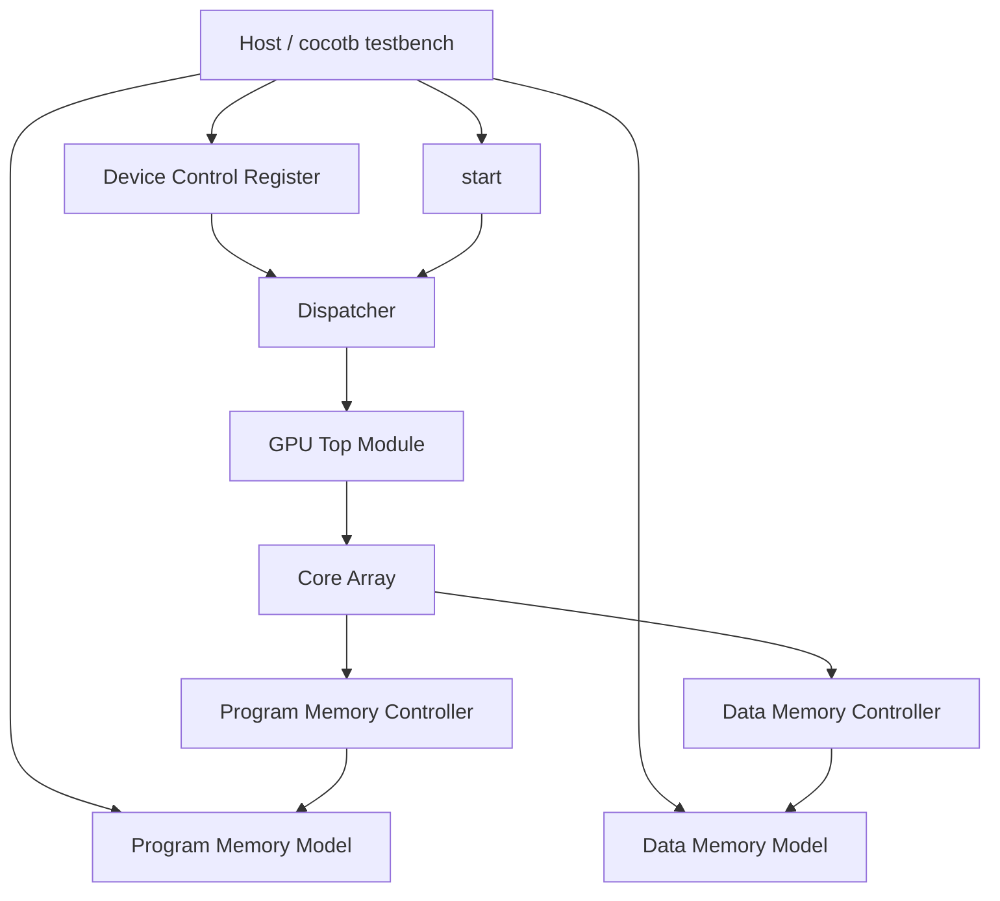

# Executive Overview

## What this repository is

`tiny-gpu` is a small educational GPU implementation written in SystemVerilog and exercised through a Python + cocotb simulation harness. The codebase is intentionally compact: the hardware lives entirely in `src/`, the tests live entirely in `test/`, and the project uses two example kernels to demonstrate SIMD-style execution on a simplified GPU architecture.

The local checkout is connected to `https://github.com/adam-maj/tiny-gpu.git`. External DeepWiki material was used as a secondary explanatory source, but local source files remain the authority for implementation details.

## Confirmed headline findings

- The hardware source is concentrated in 12 SystemVerilog modules under `src/`.
- The top-level implementation is `src/gpu.sv`, which instantiates the device control register, dispatcher, two memory controllers, and a configurable array of compute cores.
- Each core contains one `fetcher`, one `decoder`, one `scheduler`, and per-thread `alu`, `lsu`, `registers`, and `pc` units.
- The execution model is explicitly staged in the scheduler as `FETCH -> DECODE -> REQUEST -> WAIT -> EXECUTE -> UPDATE`.
- The verification story is cocotb-driven: Python code simulates both program memory and data memory while the RTL runs inside Icarus Verilog.
- Two proof-of-concept kernels are exercised by tests: matrix addition and matrix multiplication.

## High-level architecture

## Toolchain summary

The build and simulation flow depends on four external tools:

| Tool | Role in this repo | Grounded evidence | Official reference used here |
| --- | --- | --- | --- |
| `cocotb` | Python testbench framework | `test/helpers/setup.py`, `test/test_*.py`, `Makefile` | cocotb docs on async tests, clocks, triggers, and DUT signal access |
| `iverilog` / `vvp` | compiles and runs the Verilog simulation | `Makefile` | Icarus Verilog docs for `-g2012`, `-s`, and VPI runtime flags |
| `sv2v` | converts SystemVerilog to Verilog before compilation | `Makefile`, `README.md` | sv2v README usage and CLI options |
| `gtkwave` | optional waveform/debug viewer | `Makefile` (`show_%` rule and TODO only) | GTKWave docs for post-mortem waveform inspection |

## Important caveats

- The README discusses a cache as if it were part of the architecture, but there is no cache module in `src/` and no cache instantiated in `src/gpu.sv`.
- The build flow assumes a pre-existing `build/` directory; the `Makefile` does not create it.
- `test/test_matmul.py` contains a function named `test_matadd`, so the filename and exported test name do not match.
- The source is SystemVerilog, while parts of the README describe the project more loosely as “Verilog.” The actual flow uses `sv2v` first, then `iverilog`.

## Overall assessment

This is a disciplined educational hardware repository with a clear module boundary at the GPU/core/thread levels, a compact verification surface, and unusually readable conceptual documentation. Its main rough edge is not architectural chaos; it is the gap between conceptual discussion in the README and what is concretely implemented in the checked-in RTL.
