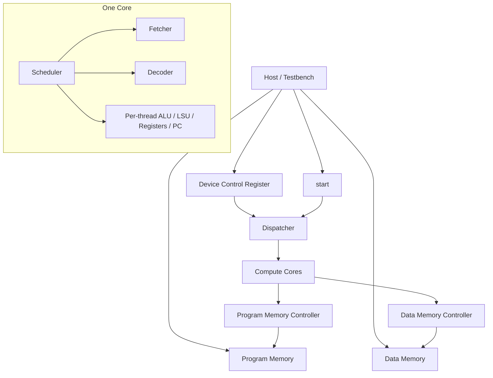
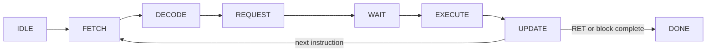
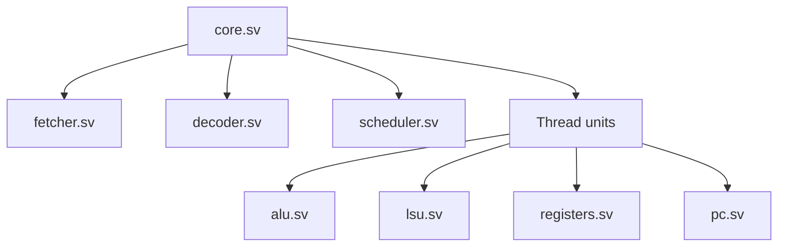
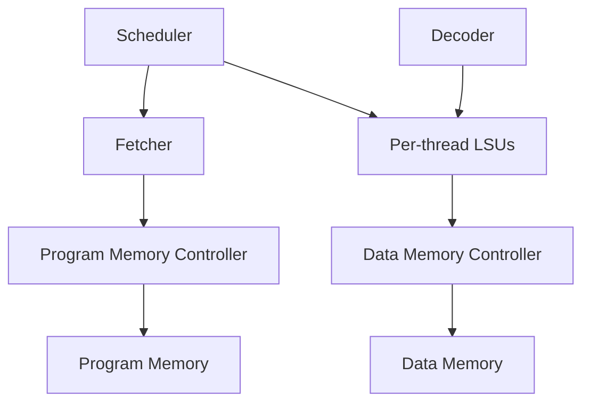

# Architecture and Execution

## Top-level architecture

The design centers on the `gpu` module in `src/gpu.sv`. External DeepWiki material describes the project using the same broad decomposition seen in the local RTL: top-level GPU control, block dispatch, memory arbitration, and per-core execution resources. The wording in this report is still grounded primarily in the checked-in source.

The top-level interface makes the execution model explicit:

- host-side control (`start`, `done`, and the device-control write interface)
- external program-memory read interface
- external data-memory read/write interface

The top-level module wires together four major subsystems:

1. `dcr` — stores the thread count for the active kernel
2. `dispatch` — divides threads into blocks and assigns them to cores
3. `controller` instances — arbitrate between internal requesters and external memory channels
4. `core` instances — execute blocks of threads

## System architecture diagram



## Confirmed execution model

The core execution pipeline is not just described in prose; it is encoded directly in `src/scheduler.sv` as a state machine:

- `IDLE`
- `FETCH`
- `DECODE`
- `REQUEST`
- `WAIT`
- `EXECUTE`
- `UPDATE`
- `DONE`

The scheduler processes one block at a time through these stages. `WAIT` explicitly inspects LSU state and does not advance until no thread is still waiting on memory.

## Instruction flow



## Per-core organization

Each `core` contains:

- one `fetcher`
- one `decoder`
- one `scheduler`
- one ALU per supported thread
- one LSU per supported thread
- one register file per supported thread
- one PC unit per supported thread

This replication is created with a `generate` block in `src/core.sv`, so the amount of thread-local hardware scales with `THREADS_PER_BLOCK`.

## Core-to-thread decomposition



## SIMD-style thread model

The SIMD flavor comes from replicated per-thread state plus shared control flow. Confirmed details from `src/registers.sv`:

- 16 registers per thread
- `R0` through `R12` are writable general-purpose registers
- register 13 stores `%blockIdx`
- register 14 stores `%blockDim`
- register 15 stores `%threadIdx`

This lets each thread execute the same decoded instruction stream while operating on different local data.

## Dispatch behavior

`src/dispatch.sv` computes the number of blocks as:

```text
total_blocks = (thread_count + THREADS_PER_BLOCK - 1) / THREADS_PER_BLOCK
```

It then assigns blocks to available cores, tracking both `blocks_dispatched` and `blocks_done`. The final block may contain fewer threads than `THREADS_PER_BLOCK`; that case is handled by passing a reduced `core_thread_count`.

## Memory system

The memory model is intentionally simple but concrete.

### Program memory

- read-only at the controller level (`WRITE_ENABLE = 0` in `gpu.sv`)
- one fetcher per core issues requests
- fetched instructions are 16 bits wide

### Data memory

- read/write through LSU-generated requests
- multiple LSU consumers share a controller
- the controller tracks which consumer each channel is currently serving

The `controller` module is therefore a reusable arbitration layer rather than a one-off memory wrapper.

## Memory and control relationships



## Branching and convergence

The design supports `CMP` and `BRnzp`, but branch handling is intentionally naive.

Confirmed from `src/scheduler.sv`, `src/pc.sv`, and `src/core.sv`:

- each thread computes its own `next_pc`
- the scheduler updates the shared `current_pc` specifically from `next_pc[THREADS_PER_BLOCK-1]`
- the source contains an explicit TODO around branch divergence

The practical interpretation is that the current implementation assumes per-block control-flow convergence rather than supporting true branch divergence.

There is also a narrower implementation caveat for short final blocks: `pc` instances are enabled only when `i < thread_count` in `src/core.sv`, but the scheduler still takes `next_pc[THREADS_PER_BLOCK-1]` as the block-wide next PC. In a partial block, that means the shared PC is sourced from the last thread slot even when that slot is not active.

## ISA implementation notes

`src/decoder.sv` decodes the following opcode set:

- `NOP`
- `BRnzp`
- `CMP`
- `ADD`
- `SUB`
- `MUL`
- `DIV`
- `LDR`
- `STR`
- `CONST`
- `RET`

That matches the ISA described in the README.

## DeepWiki-aligned interpretation

DeepWiki’s external documentation is useful here because it reinforces the same top-level understanding without changing the source-grounded conclusions:

- `gpu.sv` is the orchestration boundary
- `dispatch.sv` is the scheduling boundary between kernel-wide work and core-local work
- `core.sv` is the composition boundary for execution resources
- `scheduler.sv` is the canonical control-flow definition for instruction progression
- `controller.sv` is the memory arbitration boundary shared by instruction and data access paths

## Implemented behavior versus conceptual roadmap

The README discusses cache, branch divergence, memory coalescing, pipelining, and warp scheduling. In the checked-in RTL, those are future-facing concepts rather than implemented subsystems. Any architecture explanation should therefore separate:

- **implemented today** — the modules in `src/` and their current behaviors
- **described conceptually** — the README’s explanations of how real GPUs are optimized
- **planned work** — items called out in the README’s future-facing sections
