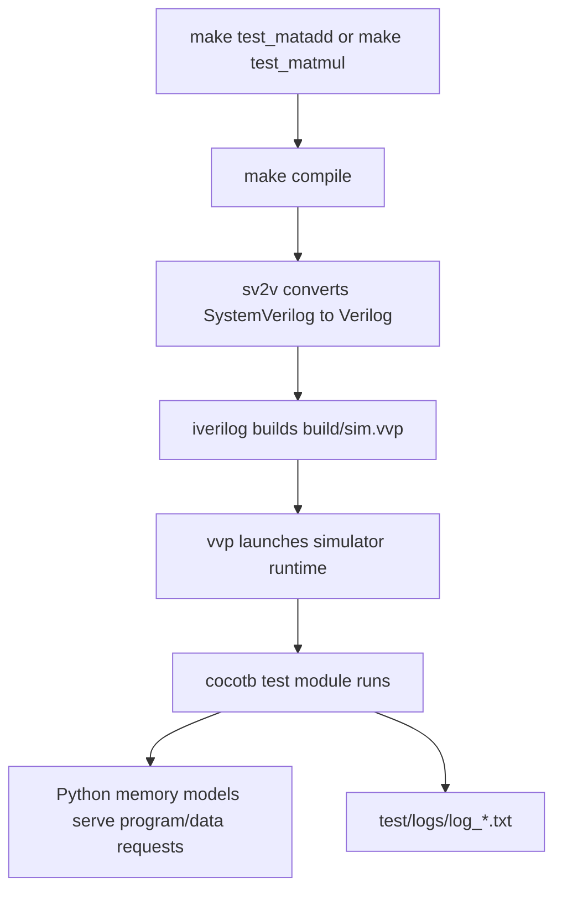

# Build and Test Workflow

## Toolchain

The current repository workflow depends on:

- `sv2v`
- `iverilog`
- `vvp`
- `cocotb`
- Python for the cocotb tests and helpers
- optionally `gtkwave` for waveform inspection

The README also instructs users to create a `build/` directory manually before running the flow.

## Confirmed Makefile behavior

From `Makefile`:

### `make compile`

1. Runs `make compile_alu`
2. Runs `sv2v -I src/* -w build/gpu.v`
3. Appends `build/alu.v` into `build/gpu.v`
4. Prepends a `` `timescale 1ns/1ns `` line via a temporary file

### `make test_matadd` / `make test_matmul`

1. Calls `make compile`
2. Runs:

```bash
iverilog -o build/sim.vvp -s gpu -g2012 build/gpu.v
```

3. Runs cocotb through `vvp` with:

```bash
MODULE=test.test_$* vvp -M $(cocotb-config --prefix)/cocotb/libs -m libcocotbvpi_icarus build/sim.vvp
```

That means `make test_matadd` loads `test.test_matadd`, and `make test_matmul` loads `test.test_matmul`.

## Tool flow diagram



## Testbench behavior

The cocotb setup in `test/helpers/setup.py` does the following:

1. starts a clock with `Clock(dut.clk, 25, units="us")`
2. asserts then deasserts reset
3. loads program memory contents from a Python list
4. loads data memory contents from a Python list
5. writes the desired thread count into the DUT device-control register
6. asserts `dut.start`

`setup()` does not deassert `dut.start` afterward, so the testbench effectively drives a level-high start condition for the remainder of the run.

The main test loop then repeatedly:

- runs the software memory models (`program_memory.run()` and `data_memory.run()`)
- waits for a read-only phase
- logs the trace state
- advances one clock edge

Execution ends when `dut.done` becomes `1`.

## Why the cocotb structure matches the official model

The repository’s cocotb code follows the documented cocotb pattern closely:

- tests are `async` Python coroutines
- DUT signals are accessed as `dut.<signal>.value`
- the testbench uses `Clock` to drive `dut.clk`
- synchronization uses triggers such as `RisingEdge` and read-only phases

That is exactly the kind of flow cocotb’s documentation presents for coroutine-based HDL tests.

## Why the Icarus command line matches the official model

The `iverilog` invocation also matches the documented usage:

- `-g2012` enables IEEE 1800-2012 / SystemVerilog language support
- `-s gpu` explicitly selects `gpu` as the root module for elaboration
- `vvp -M ... -m libcocotbvpi_icarus` loads the cocotb VPI module into the simulator runtime

This is the key bridge between the generated Verilog simulation and the Python cocotb test process.

## `sv2v` in this repository

The `sv2v` project documents itself as a SystemVerilog-to-Verilog converter aimed at synthesizable constructs, with `-w` used to write output files and `-I` / `--incdir` used to extend the include search path. That explains the intent of this repository’s compile stage, which as written emits generated Verilog into `build/` before invoking `iverilog`.

One subtle but important nuance from the official `sv2v` usage docs: users usually pass all relevant SystemVerilog files together so the converter can resolve cross-file constructs. This repository instead runs the atypical compile rules exactly as written in the `Makefile`: `alu.sv` is converted separately and appended into `build/gpu.v`, while the main `sv2v -I src/* -w build/gpu.v` invocation does not explicitly list input files in the rule itself. The report therefore describes the Makefile faithfully, but should not imply that this is the standard or obviously complete `sv2v` invocation pattern.

## Memory simulation strategy

The hardware does not connect to an external simulator-owned memory model directly. Instead, `test/helpers/memory.py` emulates the external memories in Python by:

- decoding DUT read-valid signals and addresses
- returning ready/data when a valid request is present
- updating internal Python memory arrays on writes

This keeps the tests compact and makes memory behavior easy to inspect in logs, but it also means timing is idealized compared with a more realistic external-memory model.

## Output artifacts

The logger in `test/helpers/logger.py` writes trace logs to:

```text
test/logs/log_<timestamp>.txt
```

These logs include:

- memory dumps
- instruction traces
- core state
- fetcher and LSU state
- register contents

If waveform dumping is enabled separately, GTKWave is the natural viewer for offline inspection of those dump files. GTKWave’s own docs describe it as a post-mortem waveform browser for formats such as VCD and related traces.

## External reference map

| Tool | Repo use | Most relevant official concepts |
| --- | --- | --- |
| `cocotb` | Python coroutine testbench | `@cocotb.test`, `Clock`, `RisingEdge`, `ReadOnly`, DUT signal access |
| `iverilog` | compile generated Verilog | `-g2012`, `-s <topmodule>`, Verilog/SystemVerilog elaboration |
| `vvp` | run compiled simulation | `-M` module search path, `-m` load VPI module |
| `sv2v` | convert SystemVerilog before compile | `-w` output file, `-I/--incdir`, synthesizable SystemVerilog focus |
| `gtkwave` | optional debug viewer | offline waveform browsing and signal inspection |

## Notable rough edges

- The `Makefile` does not create `build/`, so a first-time user who skips the README setup step will fail early.
- `test/test_matmul.py` exports a test function named `test_matadd`, which is confusing even though the module name still determines which file cocotb loads.
- The flow is optimized for local learning and simulation, not for a polished CI or packaging experience.
