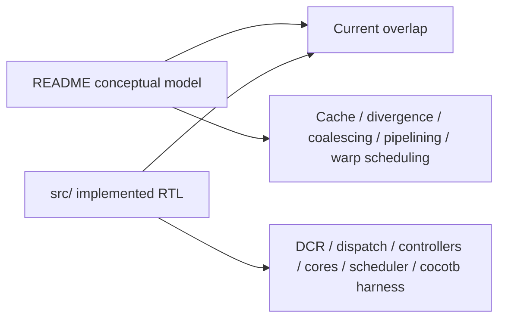

# Risks, Limitations, and Open Questions

## Confirmed current limitations

These points are supported by the checked-in source, not merely by the README’s narrative.

### 1. No implemented cache module

The README describes cache as part of the architecture, but the source tree contains no cache module and `gpu.sv` instantiates no cache layer. This is the single largest source-to-documentation mismatch in the repo.

### 2. No branch divergence support

`scheduler.sv` contains an explicit TODO indicating that branch divergence is not implemented and that the current design assumes next-PC convergence. That keeps the design simple, but it also means kernels that require divergent per-thread control flow are out of scope.

### 3. No pipelining or overlap beyond basic async memory waiting

The scheduler waits for one instruction lifecycle to finish before progressing to the next instruction. That matches the repository’s educational goal, but it also means throughput-oriented optimizations are intentionally absent.

### 4. Simple memory timing assumptions in tests

The Python memory model responds as soon as valid requests are observed. This is good for clarity, but it idealizes memory timing and does not stress the design with realistic latency or backpressure behavior.

## Documented versus implemented

The safest interpretation is:

- treat `README.md` as the conceptual guide
- treat `src/` as the source of truth for implemented behavior
- treat advanced features as roadmap items unless concrete RTL supports them

## Repository inconsistencies worth preserving in docs

### README uses present-tense architecture language for cache

That wording can lead a new reader to expect cache logic in `src/`, but the current checkout does not support that expectation.

### `test/test_matmul.py` naming mismatch

The file is clearly the matrix-multiplication test, but its exported cocotb function is named `test_matadd`. That does not invalidate the test flow, yet it is still a maintenance smell.

### Build-directory prerequisite lives in README, not in automation

The current flow assumes `build/` already exists. A more ergonomic local workflow would create it from the Makefile itself.

## Open questions raised by the current checkout

### GDS provenance

`gds/0/gpu.gds` and `gds/1/gpu.gds` exist, but the repository does not explain:

- what flow produced them
- what distinguishes `0/` from `1/`
- whether they represent revisions, experiments, or packaging targets

### Physical-design context

There are hints that physical-design constraints shaped parts of the RTL, but the repository does not include a dedicated note explaining the larger downstream flow.

### Scope of future work versus architectural commitments

The README’s “Next Steps” section mentions cache, branch divergence, memory coalescing, pipelining, graphics, and other extensions. Those should be read as roadmap intent, not as partially implemented subsystems, unless the source clearly shows otherwise.

## Recommended interpretation for future readers

This repository is best understood as a compact educational GPU whose main value is architectural clarity. The code is concrete enough to simulate real kernels, but many of the README’s advanced topics are there to teach what real GPUs do next, not to claim that tiny-gpu already does it.
